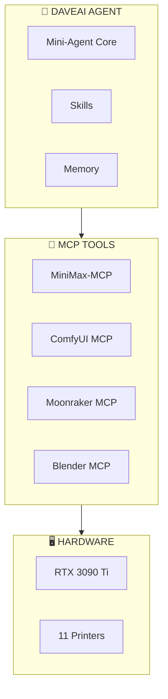

# DaveAI - Agentic 3D Print Factory

**Local • Private • Unlimited • Agentic**

*Build Date: April 26, 2026*

---

## What is DaveAI?

DaveAI transforms photos into physical 3D prints using an autonomous agent powered by Mini-Agent + MiniMax + ComfyUI + Klipper.

```
📷 Photo → 🤖 AI Analysis → 🎨 3D Generation → 🔧 Mesh Processing → 🗺️ Fleet Routing → 🖨️ Physical Print
```

---

## Quick Start

### 1. Install Dependencies

```bash
# Clone/fork Mini-Agent as submodule
cd 3d-printer-daveai
git submodule update --init Mini-Agent

# Install Python dependencies
uv sync

# Install MiniMax-MCP
npm install -g @minimax-ai/mcp-server

# Verify Blender CLI
blender --version
```

### 2. Configure

```bash
# Copy config templates
cp config/config-example.yaml config/config.yaml

# Edit with your API keys
# MINIMAX_API_KEY=your_key_here
# MOONRAKER_API_KEY=your_key_here
```

### 3. Run

```bash
# Start DaveAI agent
uv run python -m mini_agent.cli --config config/config.yaml
```

---

## Architecture



---

## Project Structure

```
3d-printer-daveai/
├── config/
│   ├── config.yaml         # Agent configuration
│   ├── mcp.json           # MCP server connections
│   └── system_prompt.md   # DaveAI personality
│
├── mcp/                    # Custom MCP servers
│   ├── comfyui-mcp/       # 3D generation control
│   ├── moonraker-mcp/     # Printer fleet control
│   └── blender-mcp/       # Mesh processing
│
├── skills/                 # Agent skills
│   ├── 3d-print-workflow/ # Main print pipeline
│   ├── printer-router/      # Fleet routing
│   ├── fleet-monitor/     # Status monitoring
│   └── batch-processor/   # Queue management
│
├── scripts/
│   ├── blender/            # Standalone Blender scripts
│   └── klipper/           # Moonraker helpers
│
├── workflows/              # ComfyUI workflows
│   ├── hunyuan3d-workflow.json
│   └── trellis2-workflow.json
│
└── docs/                   # Documentation
    ├── 01-system-architecture.md
    ├── 02-hardware-inventory.md
    ├── 03-end-to-end-workflow.md
    ├── 04-fleet-routing.md
    ├── 05-agentic-system.md
    ├── 06-blender-automation.md
    ├── 07-firmware-setup.md
    ├── 08-mcp-servers.md
    ├── 09-skills.md
    └── ROADMAP.md
```

---

## Fleet (11 Printers)

| Printer | Type | Build Volume | Best For |
|---------|------|-------------|----------|
| FLSUN V400 | Delta | 300x300mm | Miniatures, Speed |
| FLSUN T1 x2 | Delta | 300x400mm | Balanced |
| FLSUN S1 | Delta | 300x400mm | General |
| FLSUN Super Racer | Delta | 300x400mm | Speed |
| FLSUN QQ-S Pro | Delta | 255x300mm | Compact |
| Creality CR-10S | Cartesian | 300x300x400mm | Large |
| Creality CR-6 Max | Cartesian | 300x300x400mm | Large, Stable |
| Tronxy D01 Pro | Cartesian | Enclosed | ABS/ASA |
| Tronxy X5SA Pro | Cartesian | 330x330x400mm | XL |
| Prusa MK3S | Cartesian | 250x210x210mm | Precision |
| Sovol SV-01 | Cartesian | 280x280x320mm | Testing |

---

## MCP Tools

### MiniMax-MCP
- `images_understand` - Vision analysis
- `gen_images` - Generate reference images
- `tts` / `stt` - Voice interaction

### ComfyUI MCP
- `comfyui_queue_prompt` - Start 3D generation
- `comfyui_get_history` - Track progress
- `comfyui_get_output` - Download OBJ/GLB

### Moonraker MCP
- `moonraker_get_fleet_status` - All printer states
- `moonraker_upload_file` - Send STL to printer
- `moonraker_start_print` - Execute print

### Blender MCP
- `blender_repair_mesh` - Fix mesh issues
- `blender_solidify` - Add wall thickness
- `blender_export_stl` - Export print-ready STL

---

## Example Usage

### Print a Photo
```
User: Print this toy figure
Photo: toy.jpg

Agent:
✓ Analyzing photo...
✓ Object: Toy figure, humanoid
✓ Generating 3D model (Hunyuan3D)...
✓ Processing mesh...
✓ Wall thickness: 2.5mm
✓ Routing to printer: FLSUN T1 #1
✓ Print started: 67%
```

### Check Fleet Status
```
User: What's the fleet status?

Agent:
🖨️ FLEET STATUS

🟢 IDLE (7)
  FLSUN V400, T1 #1, S1, CR-10S, D01, MK3S, SV01

🔵 PRINTING (4)
  FLSUN T1 #2: dragon.stl - 67% - ETA 1h 23m
  Super Racer: proto.stl - 23%
  CR-6 Max: case.stl - 89%
  X5SA Pro: base.stl - 8%
```

---

## Documentation

| Doc | Description |
|-----|-------------|
| [ROADMAP.md](ROADMAP.md) | Build roadmap and implementation plan |
| [docs/01-system-architecture.md](docs/01-system-architecture.md) | System architecture |
| [docs/02-hardware-inventory.md](docs/02-hardware-inventory.md) | Hardware specs |
| [docs/03-end-to-end-workflow.md](docs/03-end-to-end-workflow.md) | Complete workflow |
| [docs/04-fleet-routing.md](docs/04-fleet-routing.md) | Printer routing logic |
| [docs/05-agentic-system.md](docs/05-agentic-system.md) | Agent architecture |
| [docs/06-blender-automation.md](docs/06-blender-automation.md) | Blender scripts |
| [docs/07-firmware-setup.md](docs/07-firmware-setup.md) | Klipper setup |
| [docs/08-mcp-servers.md](docs/08-mcp-servers.md) | MCP server docs |
| [docs/09-skills.md](docs/09-skills.md) | Skills reference |

---

## Requirements

| Component | Requirement |
|-----------|-------------|
| GPU | RTX 3090 Ti (24GB VRAM) |
| RAM | 32-64 GB |
| Storage | 2TB+ NVMe SSD |
| Printers | 11x Klipper-enabled |
| Software | Blender 4.x, ComfyUI |

---

## License

Private use only. Built for maximum productivity.
