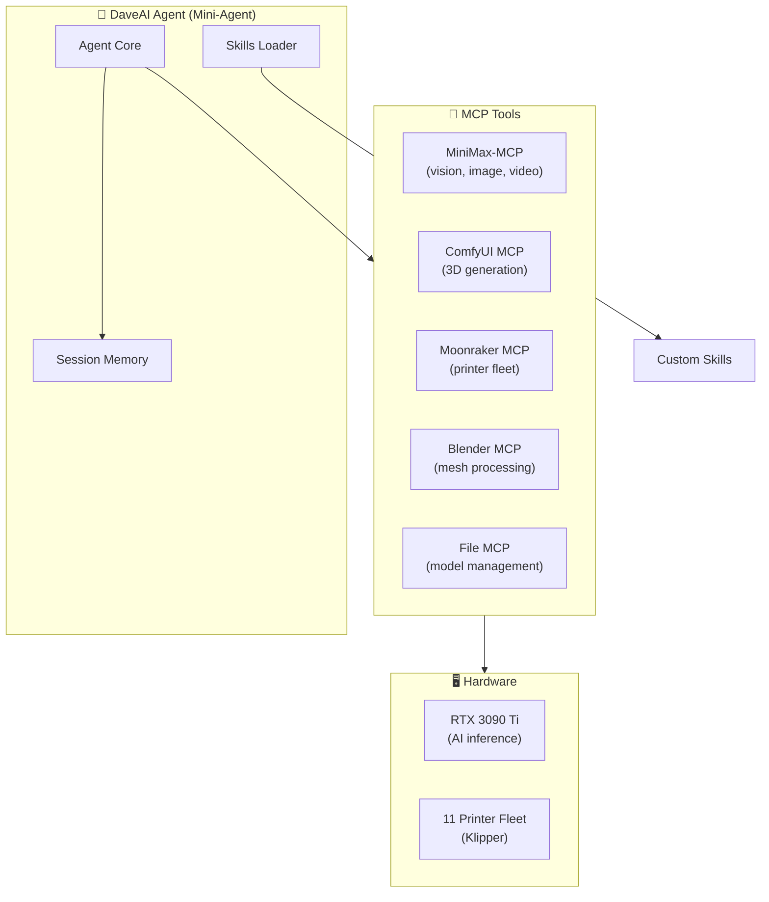

# DaveAI - Agentic 3D Print Factory
## Build Roadmap v1.0

**Owner:** Matrix Agent  
**Date:** April 26, 2026  
**Foundation:** Mini-Agent + MiniMax Stack  
**Goal:** Fully autonomous 3D print factory (photo → physical print)

---

## Philosophy

```
Build only what works. No AI slop. No fluff.

Mini-Agent is the foundation.
MiniMax-MCP gives media superpowers.
Custom MCPs connect to real hardware.
```

---

## What We're Building

```
┌─────────────────────────────────────────────────────────────────┐
│  📷 Photo Input → 🤖 AI Analysis → 🎨 3D Generation            │
│                                                                  │
│  → 🔧 Blender Processing → 🗺️ Fleet Routing → 🖨️ Physical Print │
│                                                                  │
│  11-Printer Fleet: 5x Delta (FLSUN) + 6x Cartesian              │
│  All running Klipper + Moonraker API                            │
└─────────────────────────────────────────────────────────────────┘
```

---

## Quick Reference: What to Include

### ✅ FROM MiniMax Usefulness Map (USE THESE)

| Source | Component | Why | Status |
|--------|-----------|-----|--------|
| `MiniMax-MCP` | Media tools (image/video/music/speech) | Vision for photo analysis | Required |
| `Mini-Agent` | Core agent loop | Foundation of DaveAI | Required |
| `Mini-Agent skills/` | mcp-builder, skill-creator | Build custom skills/MCPs | Required |
| `Mini-Agent skills/document-skills/` | PDF, DOCX, PPTX, XLSX | Reports and documentation | Required |
| `MiniMax-Coding-Plan-MCP` | Web search + image understanding | Research and coding workflows | Required |
| `OpenRoom` | UI patterns for agentic desktop | Reference for DaveAI UI | Reference |

### ❌ FROM MiniMax Usefulness Map (SKIP THESE)

| Source | Reason to Skip |
|--------|----------------|
| `MiniMax-M2` (local) | Too large for RTX 3090 Ti alone |
| `MiniMax-M1` | Research only, not production |
| `vercel-minimax-ai-provider` | Not building Vercel app |
| `MiniMax-Hackathon` | Low value examples |
| `audio-tools` | Not needed for 3D printing |

---

## Architecture Overview



---

## PHASE 1: Foundation Setup

**Goal:** Get Mini-Agent running with MiniMax-MCP

### Stage 1.1: Core Environment

| Task | Description | Validation |
|------|-------------|------------|
| 1.1.1 | Clone/verify Mini-Agent at `Mini-Agent/` | Agent starts without errors |
| 1.1.2 | Install dependencies with `uv` | `uv sync` completes |
| 1.1.3 | Create `config/config.yaml` with MiniMax API key | `mmx quota` works |
| 1.1.4 | Configure `mcp.json` with MiniMax-MCP | MCP tools load |

### Stage 1.2: MiniMax-MCP Integration

```yaml
# config/mcp.json - Phase 1
mcpServers:
  minimax:
    command: "npx"
    args: ["-y", "@minimax-ai/mcp-server"]
    env:
      MINIMAX_API_KEY: "${MINIMAX_API_KEY}"
```

| Task | Description | Validation |
|------|-------------|------------|
| 1.2.1 | Install MiniMax-MCP via npx or local | `images_understand` tool works |
| 1.2.2 | Test vision tool with sample photo | Object detection returns results |
| 1.2.3 | Test image generation capability | Can generate reference images |

### Stage 1.3: Basic Agent Test

| Task | Description | Validation |
|------|-------------|------------|
| 1.3.1 | Run agent with system prompt | Agent responds |
| 1.3.2 | Test file read/write tools | Can read/write workspace files |
| 1.3.3 | Test bash/shell execution | Can run PowerShell commands |

**Phase 1 Exit Criteria:** Agent runs, MiniMax-MCP tools accessible.

---

## PHASE 2: Custom MCPs for 3D Printer System

**Goal:** Build MCPs that connect to ComfyUI, Blender, Moonraker

### Stage 2.1: ComfyUI MCP

**Purpose:** Control 3D generation via ComfyUI API

```yaml
# config/mcp.json - Phase 2 additions
mcpServers:
  comfyui:
    type: streamable_http
    url: "http://localhost:8188"
    headers:
      # Optional auth if enabled
```

| Task | Tool | Description |
|------|------|-------------|
| 2.1.1 | `comfyui_prompt` | Send workflow JSON to ComfyUI |
| 2.1.2 | `comfyui_status` | Check generation progress |
| 2.1.3 | `comfyui_get_image` | Retrieve generated OBJ/GLB |
| 2.1.4 | `comfyui_list_workflows` | List available workflows |

**Implementation:** Wrap ComfyUI's REST API + WebSocket for progress.

### Stage 2.2: Moonraker/Klipper MCP

**Purpose:** Control 11-printer fleet via Moonraker REST API

```yaml
# config/mcp.json - Phase 2 additions
mcpServers:
  moonraker:
    type: streamable_http
    url: "http://mainsail.local:7125"
```

| Task | Tool | Description |
|------|------|-------------|
| 2.2.1 | `get_fleet_status` | List all printers + status |
| 2.2.2 | `get_printer_info` | Get specific printer state |
| 2.2.3 | `upload_file` | Upload STL/G-code to printer |
| 2.2.4 | `start_print` | Begin print job |
| 2.2.5 | `cancel_print` | Cancel active print |
| 2.2.6 | `get_print_progress` | Monitor print % |

**Moonraker Endpoints:**
```
GET  /api/server info          # Fleet overview
GET  /api/printer/objects/list # Printer capabilities
POST /api/files/local/upload   # Upload files
POST /api/job/print            # Start print
POST /api/job/cancel           # Cancel print
WS   /websocket                # Real-time updates
```

### Stage 2.3: Blender MCP

**Purpose:** Automate mesh processing (repair, solidify, export)

| Task | Tool | Description |
|------|------|-------------|
| 2.3.1 | `blender_import` | Load OBJ/GLB into Blender |
| 2.3.2 | `blender_repair` | Fix mesh issues (holes, normals) |
| 2.3.3 | `blender_solidify` | Add wall thickness |
| 2.3.4 | `blender_check_print` | Validate printability |
| 2.3.5 | `blender_export_stl` | Export print-ready STL |

**Implementation:** Blender headless CLI + Python scripts

```bash
# Example Blender CLI call
blender --background --python script.py
```

### Stage 2.4: File System MCP (if needed beyond Mini-Agent)

| Task | Tool | Description |
|------|------|-------------|
| 2.4.1 | `watch_folder` | Monitor input directory |
| 2.4.2 | `list_models` | List generated models |
| 2.4.3 | `move_file` | Organize output files |

**Phase 2 Exit Criteria:** All 4 MCPs functional, agent can call them.

---

## PHASE 3: Skills Development

**Goal:** Create specialized skills for 3D print workflows

### Stage 3.1: Core Skills

#### Skill: `3d-print-workflow`

```yaml
# skills/3d-print-workflow/SKILL.md
---
name: 3d-print-workflow
description: Execute complete 3D print pipeline: photo → 3D → process → print
---
```

**Workflow:**
1. Receive photo + requirements
2. Analyze with MiniMax vision
3. Generate 3D via ComfyUI
4. Process via Blender
5. Route to printer
6. Monitor and notify

#### Skill: `printer-router`

**Purpose:** Intelligent printer selection based on model specs

```yaml
# skills/printer-router/SKILL.md
---
name: printer-router
description: Select optimal printer from fleet based on model dimensions, material, priority
---
```

**Decision Matrix:**
| Condition | Printer Selection |
|-----------|-------------------|
| Miniature (<50mm) + Speed | FLSUN V400 |
| Medium (100-200mm) | FLSUN T1 or S1 |
| Large (>200mm) | CR-10S or X5SA Pro |
| Precision | Prusa MK3S |
| ABS/Engineering | Tronxy D01 (enclosed) |

#### Skill: `mesh-repair`

**Purpose:** Ensure mesh is watertight and print-ready

```yaml
# skills/mesh-repair/SKILL.md
---
name: mesh-repair
description: Fix mesh issues, add solidify, validate printability
---
```

### Stage 3.2: Utility Skills

#### Skill: `fleet-monitor`

**Purpose:** Real-time monitoring of all printers

```yaml
# skills/fleet-monitor/SKILL.md
---
name: fleet-monitor
description: Watch fleet status, alert on errors, track print progress
---
```

#### Skill: `batch-processor`

**Purpose:** Handle multiple print jobs from folder/watch

```yaml
# skills/batch-processor/SKILL.md
---
name: batch-processor
description: Process queue of 3D print jobs automatically
---
```

### Stage 3.3: Documentation Skills

**From Mini-Agent skills/ directory:**

| Skill | Use Case |
|-------|----------|
| `document-skills/pdf` | Generate print reports |
| `document-skills/docx` | Export job documentation |
| `document-skills/xlsx` | Track print statistics |

**Phase 3 Exit Criteria:** 5+ skills functional, agent loads them.

---

## PHASE 4: System Prompt Engineering

**Goal:** Create system prompt that defines DaveAI personality and capabilities

### Stage 4.1: System Prompt Structure

```markdown
# DaveAI System Prompt

## Identity
You are DaveAI, an autonomous 3D print factory operator.
Your mission: Transform photos into physical prints with zero friction.

## Core Capabilities
1. Vision Analysis (MiniMax-MCP)
2. 3D Generation (ComfyUI + Hunyuan3D-2.1/TRELLIS.2)
3. Mesh Processing (Blender CLI)
4. Fleet Management (Moonraker API)
5. Print Monitoring (Real-time via WebSocket)

## Fleet Summary
[Insert printer inventory from 02-hardware-inventory.md]

## Workflow
[Insert workflow from 03-end-to-end-workflow.md]

## Routing Rules
[Insert routing matrix from 04-fleet-routing.md]

## Error Handling
[Define recovery strategies]

## Interaction Guidelines
- Proactive: anticipate issues
- Informative: explain decisions
- Efficient: parallelize when possible
```

### Stage 4.2: Memory & Context

**Session Memory:**
- Current print jobs and status
- Fleet availability
- Recent errors and resolutions

**Persistent Memory:**
- Printer capabilities and limitations
- Preferred settings per material
- Historical print statistics

**Phase 4 Exit Criteria:** Agent demonstrates correct behavior with new photos.

---

## PHASE 5: Integration & Testing

**Goal:** End-to-end testing of complete pipeline

### Stage 5.1: Unit Tests

| Test | Coverage |
|------|----------|
| ComfyUI MCP | Mock API responses |
| Moonraker MCP | Mock printer responses |
| Blender MCP | Sample OBJ processing |
| Skills | Individual skill execution |

### Stage 5.2: Integration Tests

| Test | Flow |
|------|------|
| Photo → 3D | Single photo → OBJ generation |
| OBJ → STL | Blender processing pipeline |
| STL → Print | Upload + start print |
| Monitor | Track progress to completion |

### Stage 5.3: E2E Tests

| Test | Description |
|------|-------------|
| Full Pipeline | Photo → Physical print (manual verification) |
| Batch Mode | Folder of 5+ photos processed |
| Error Recovery | Simulated failure + recovery |

**Phase 5 Exit Criteria:** Full pipeline works manually.

---

## PHASE 6: Automation & Deployment

**Goal:** DaveAI runs autonomously, accessible remotely

### Stage 6.1: Watch Folder Mode

```python
# Auto-process when files appear
watcher = Watcher("/input/photos")
watcher.on_created(process_photo)
```

### Stage 6.2: Remote Access

| Component | Technology | Purpose |
|-----------|------------|---------|
| VPN | Tailscale | Secure remote access |
| Proxy | Caddy | HTTPS + reverse proxy |
| VPS | Hostinger | External access point |

### Stage 6.3: Dashboard (Optional)

**From OpenRoom patterns:**
- Web UI for fleet overview
- Job queue visualization
- Real-time print monitoring

**Phase 6 Exit Criteria:** DaveAI runs unattended, accessible remotely.

---

## Implementation Order

```
WEEK 1: Foundation
├── 1.1 Mini-Agent setup
├── 1.2 MiniMax-MCP integration
└── 1.3 Basic agent test

WEEK 2: Custom MCPs  
├── 2.1 ComfyUI MCP
├── 2.2 Moonraker MCP
└── 2.3 Blender MCP

WEEK 3: Skills + Prompt
├── 3.1 Core skills (workflow, router, repair)
├── 3.2 System prompt engineering
└── 3.3 Memory implementation

WEEK 4: Integration
├── 5.1 Unit tests
├── 5.2 Integration tests
└── 5.3 E2E tests

WEEK 5+: Automation
├── 6.1 Watch folder
├── 6.2 Remote access
└── 6.3 Dashboard
```

---

## File Structure (Final)

```
3d-printer-daveai/
├── Mini-Agent/                    # Agent framework (clone)
├── config/
│   ├── config.yaml               # Mini-Agent config
│   ├── mcp.json                  # MCP servers
│   └── system_prompt.md          # DaveAI personality
├── skills/
│   ├── 3d-print-workflow/       # Main workflow skill
│   ├── printer-router/           # Fleet routing
│   ├── mesh-repair/              # Mesh processing
│   ├── fleet-monitor/            # Status monitoring
│   ├── batch-processor/           # Queue handling
│   └── document-skills/          # Reports (from Mini-Agent)
├── mcp/
│   ├── comfyui-mcp/              # ComfyUI integration
│   ├── moonraker-mcp/            # Printer fleet control
│   └── blender-mcp/              # Mesh processing
├── docs/
│   ├── 01-system-architecture.md
│   ├── 02-hardware-inventory.md
│   ├── 03-end-to-end-workflow.md
│   ├── 04-fleet-routing.md
│   ├── 05-agentic-system.md
│   ├── 06-blender-automation.md
│   └── 07-firmware-setup.md
├── workflows/
│   ├── hunyuan3d-workflow.json   # ComfyUI workflow
│   └── trellis2-workflow.json
├── scripts/
│   ├── blender/                   # Blender Python scripts
│   └── klipper/                  # Moonraker helpers
└── ROADMAP.md                    # This file
```

---

## Dependencies Summary

### Must Have (from MiniMax Usefulness Map)

| Component | Source | Purpose |
|-----------|--------|---------|
| Mini-Agent | Clone | Agent framework |
| MiniMax-MCP | npm | Vision + media tools |
| Skills (document) | Mini-Agent/skills | Reports |
| mcp-builder skill | Mini-Agent/skills | Build custom MCPs |

### Must Build

| Component | Purpose |
|-----------|---------|
| ComfyUI MCP | 3D generation control |
| Moonraker MCP | Fleet management |
| Blender MCP | Mesh processing |

### Optional (Reference Only)

| Component | Use |
|-----------|-----|
| OpenRoom | UI inspiration |
| MiniMax-CLI | Terminal fallback |

---

## Validation Checklist

- [ ] Mini-Agent runs with MiniMax-MCP
- [ ] ComfyUI MCP can trigger generation
- [ ] Moonraker MCP can control one printer
- [ ] Blender MCP can process OBJ → STL
- [ ] Skills load and execute
- [ ] System prompt guides correct behavior
- [ ] Full pipeline: Photo → Physical Print works
- [ ] Remote access via Tailscale functional

---

## Troubleshooting

| Issue | Solution |
|-------|----------|
| MCP tools not loading | Check mcp.json syntax, verify server connectivity |
| ComfyUI timeout | Increase timeout in mcp.json (execute_timeout: 300) |
| Moonraker auth | Set auth token in headers or disable in Moonraker config |
| Blender crash | Run Blender with `--factory-startup` flag first |

---

## Appendix: MCP Server Templates

### ComfyUI MCP (stdio)

```json
{
  "comfyui": {
    "command": "python",
    "args": ["-m", "comfyui_mcp_server"],
    "env": {
      "COMFYUI_HOST": "localhost",
      "COMFYUI_PORT": "8188"
    },
    "execute_timeout": 300
  }
}
```

### Moonraker MCP (HTTP)

```json
{
  "moonraker": {
    "type": "streamable_http",
    "url": "http://mainsail.local:7125",
    "headers": {
      "X-Api-Key": "${MOONRAKER_API_KEY}"
    }
  }
}
```

### Blender MCP (stdio)

```json
{
  "blender": {
    "command": "blender",
    "args": ["--background", "--python", "./mcp/blender-mcp/server.py"],
    "env": {},
    "execute_timeout": 120
  }
}
```

---

## Appendix: MiniMax API Integration

```yaml
# config/config.yaml
api_key: "YOUR_API_KEY"
api_base: "https://api.minimax.io"  # or api.minimaxi.com for China
model: "MiniMax-M2.5"
provider: "anthropic"
```

**Vision Test:**
```
User: Analyze this photo for 3D printing
Agent: [uses MiniMax-MCP images_understand]
→ Returns: Object type, complexity, recommended resolution
```

---

**End of Roadmap**
