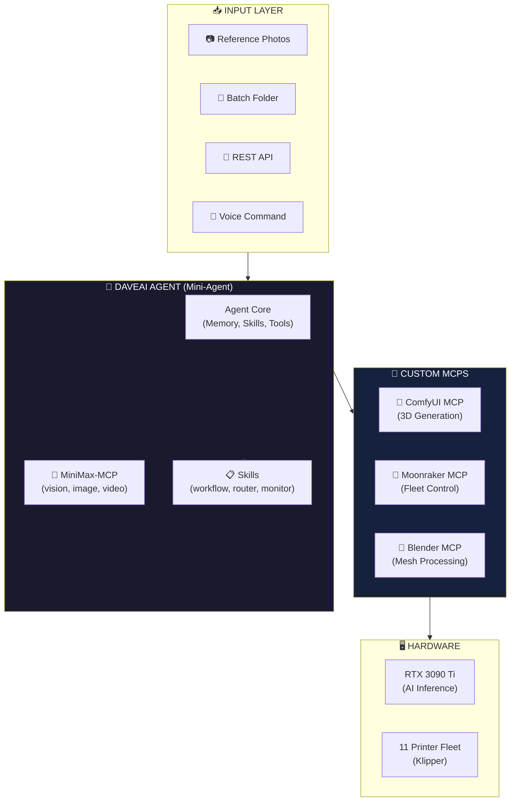
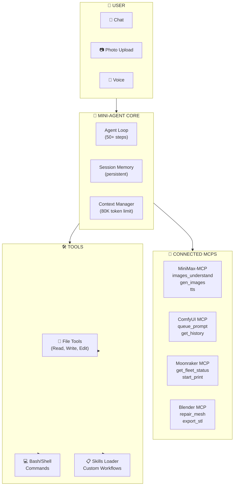
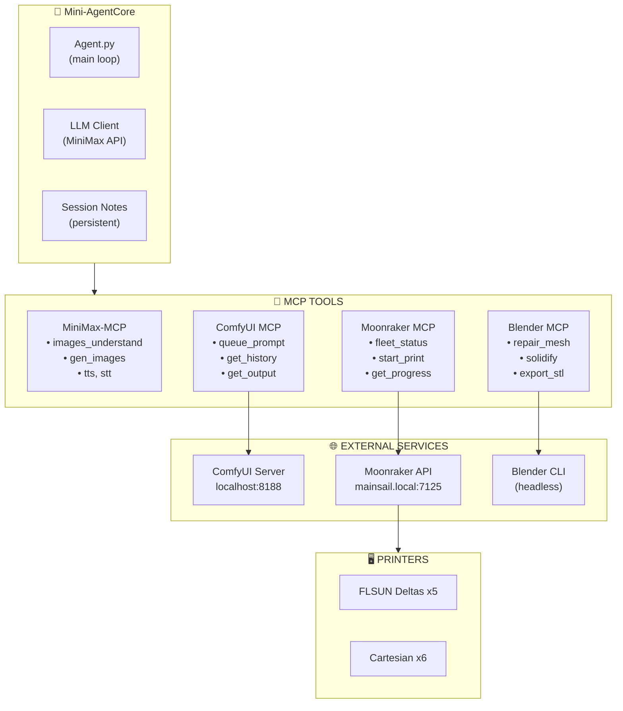
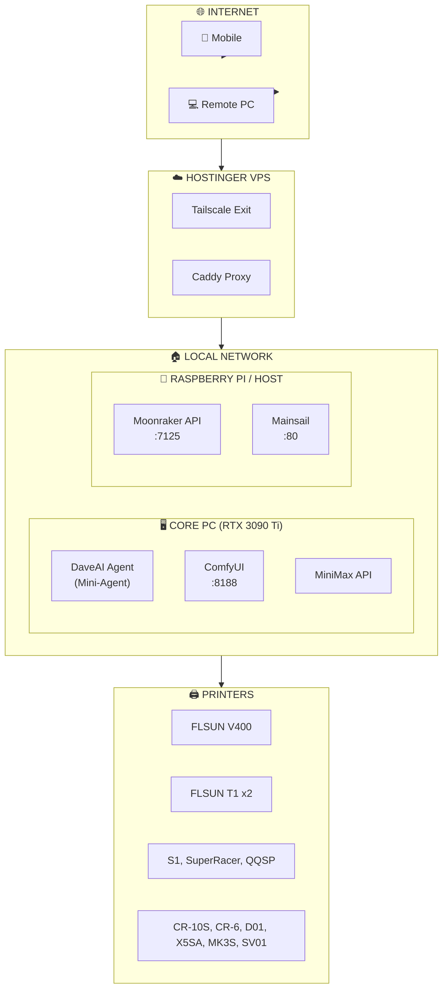
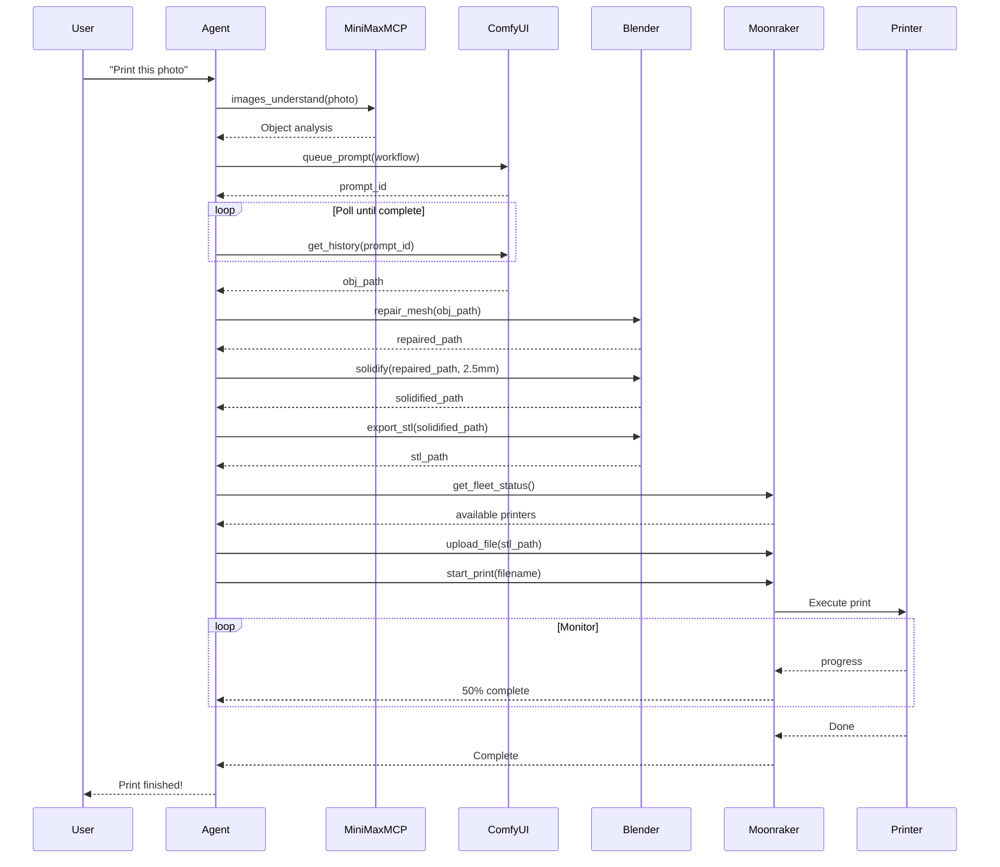

# 01 - System Architecture

## DaveAI Architecture Overview

```
┌─────────────────────────────────────────────────────────────────────────┐
│                    DAVEAI - AGENTIC 3D PRINT FACTORY                    │
├─────────────────────────────────────────────────────────────────────────┤
│  🤖 Mini-Agent Core  →  Memory, Skills, Tool Execution                │
│  🔌 MiniMax-MCP      →  Vision, Image, Voice, Media Tools              │
│  🔧 Custom MCPs     →  ComfyUI, Moonraker, Blender                    │
│  🖨️ 11-Printer Fleet →  Klipper/Moonraker Controlled                 │
└─────────────────────────────────────────────────────────────────────────┘
```

---

## High-Level System Overview



---

## DaveAI Agent Stack



---

## Data Flow Architecture

```mermaid
flowchart LR
    subgraph Input
        P["📷 Photo"]
        S["📄 STL File"]
        B["📁 Batch"]
    end

    subgraph MiniAgent["🤖 MINI-AGENT"]
        Analyze["Analyze Request"]
        Decide["Decide Action"]
        Execute["Execute Tools"]
    end

    subgraph MCPs["🔌 MCPS"]
        Vision["MiniMax Vision"]
        Generate["ComfyUI 3D"]
        Process["Blender Mesh"]
        Print["Moonraker Fleet"]
    end

    subgraph Output
        STL["💾 STL Ready"]
        Print["🖨️ Printing"]
        Status["📊 Status Update"]
    end

    Input --> MiniAgent
    MiniAgent --> MCPs
    MCPs --> Output
```



---

## Component Integration



---

## Network Architecture



---

## Communication Flow



---

## File Structure

```
3d-printer-daveai/
├── Mini-Agent/                    # Agent framework (git submodule)
│   ├── mini_agent/
│   │   ├── agent.py             # Core agent loop
│   │   ├── llm/                  # LLM clients (MiniMax, OpenAI, Anthropic)
│   │   ├── tools/               # Base tools, MCP loader
│   │   └── skills/              # Skills loader
│   └── examples/                 # Example usage
│
├── config/
│   ├── config.yaml               # Mini-Agent configuration
│   ├── mcp.json                  # MCP server connections
│   └── system_prompt.md         # DaveAI personality
│
├── mcp/                          # Custom MCP servers
│   ├── comfyui-mcp/              # ComfyUI integration
│   ├── moonraker-mcp/           # Printer fleet control
│   └── blender-mcp/             # Mesh processing
│
├── skills/                       # DaveAI skills
│   ├── 3d-print-workflow/       # Main print pipeline
│   ├── printer-router/           # Fleet routing
│   ├── fleet-monitor/           # Status monitoring
│   └── batch-processor/         # Queue management
│
├── scripts/
│   ├── blender/                  # Standalone Blender scripts
│   └── klipper/                  # Moonraker helpers
│
├── workflows/                    # ComfyUI workflows
│   ├── hunyuan3d-workflow.json
│   └── trellis2-workflow.json
│
├── docs/                         # Documentation
│   ├── 01-system-architecture.md
│   ├── 02-hardware-inventory.md
│   ├── 03-end-to-end-workflow.md
│   ├── 04-fleet-routing.md
│   ├── 05-agentic-system.md
│   ├── 06-blender-automation.md
│   ├── 07-firmware-setup.md
│   ├── 08-mcp-servers.md
│   └── 09-skills.md
│
└── output/                       # Generated files
    ├── comfyui/                  # ComfyUI outputs
    └── blender/                  # Processed STL files
```

---

## MCP Tool Reference

### MiniMax-MCP (Installed via npm)

| Tool | Description | Use Case |
|------|-------------|----------|
| `images_understand` | Analyze images with vision | Photo analysis |
| `gen_images` | Generate images | Reference creation |
| `tts` | Text to speech | Voice notifications |
| `stt` | Speech to text | Voice commands |

### ComfyUI MCP (Custom)

| Tool | Description | Use Case |
|------|-------------|----------|
| `comfyui_queue_prompt` | Queue workflow execution | 3D generation |
| `comfyui_get_history` | Get execution status | Track progress |
| `comfyui_get_output` | Download generated file | Get OBJ/GLB |

### Moonraker MCP (Custom)

| Tool | Description | Use Case |
|------|-------------|----------|
| `moonraker_get_fleet_status` | All printer statuses | Fleet overview |
| `moonraker_upload_file` | Upload to printer | Send STL |
| `moonraker_start_print` | Start print job | Execute print |
| `moonraker_get_print_stats` | Print progress | Monitor status |

### Blender MCP (Custom)

| Tool | Description | Use Case |
|------|-------------|----------|
| `blender_repair_mesh` | Fix mesh issues | Pre-print prep |
| `blender_solidify` | Add wall thickness | Make watertight |
| `blender_export_stl` | Export final STL | Ready to slice |
| `blender_check_printable` | Validate mesh | Pre-flight check |

---

## Setup Checklist

- [ ] Install Mini-Agent dependencies (`uv sync`)
- [ ] Configure `config/config.yaml` with MiniMax API key
- [ ] Configure `config/mcp.json` with all MCP servers
- [ ] Install MiniMax-MCP (`npx -y @minimax-ai/mcp-server`)
- [ ] Install Blender and verify CLI works
- [ ] Configure Moonraker API access
- [ ] Load and test skills
- [ ] Run full pipeline test
