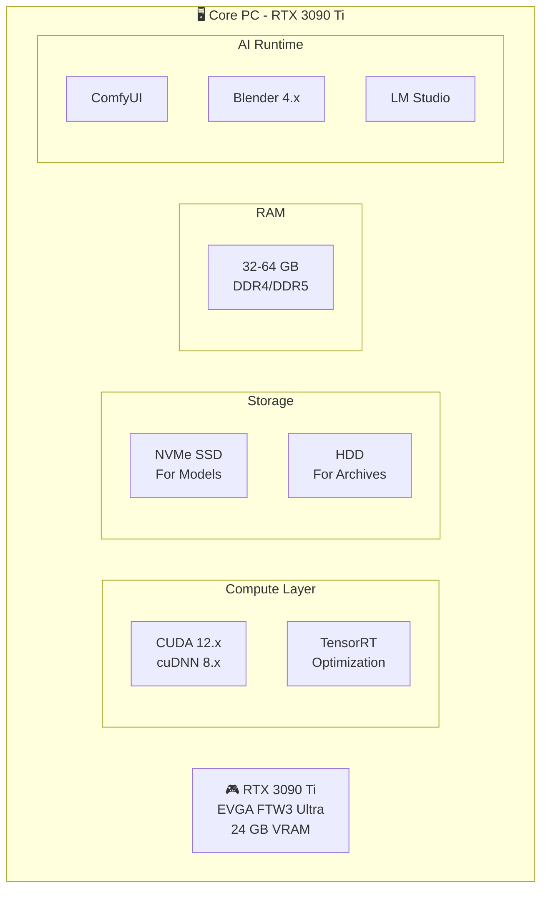
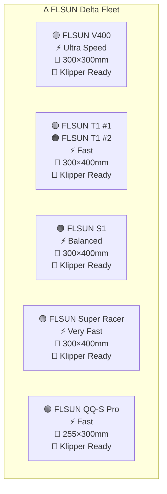
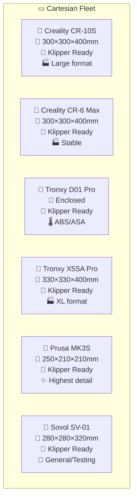
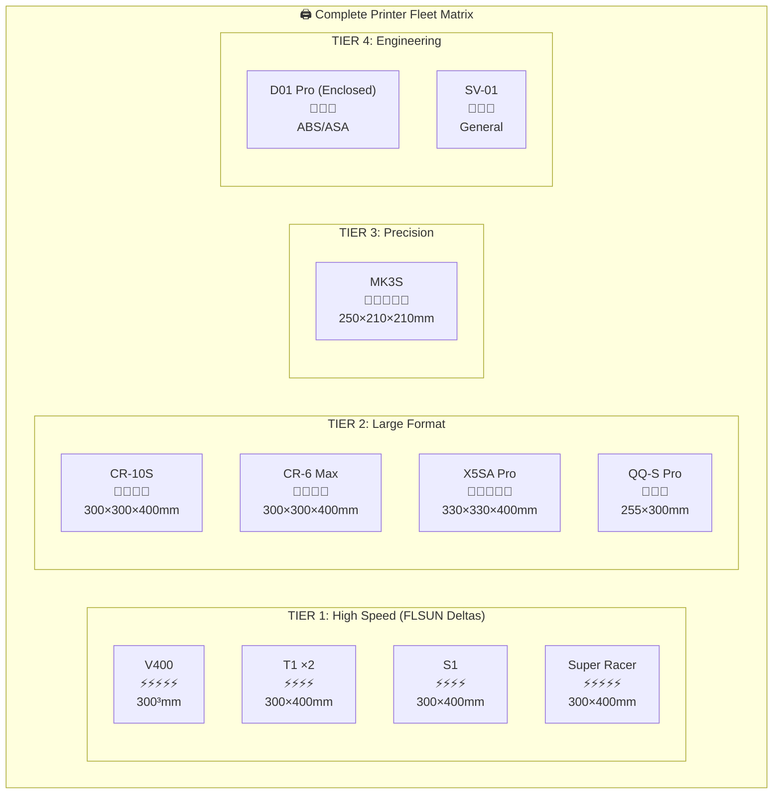
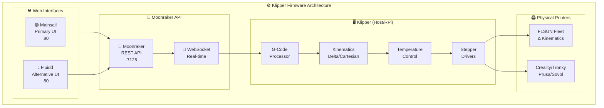

# 02 - Hardware Inventory

## Desktop Workstation



| Component | Specification | Purpose |
|-----------|---------------|---------|
| **GPU** | RTX 3090 Ti EVGA FTW3 Ultra | AI inference, 3D generation |
| **VRAM** | 24 GB GDDR6X | Large model handling |
| **RAM** | 32-64 GB | System + model caching |
| **Storage** | NVMe SSD (2TB+) | Fast model loading |
| **CPU** | Modern multi-core | System orchestration |

---

## Printer Fleet - Complete Inventory

### Delta Printers (FLSUN)

| Printer | Quantity | Build Volume | Kinematics | Speed | Best For |
|---------|----------|--------------|------------|-------|----------|
| **FLSUN V400** | 1 | 300×300 mm | Delta | Ultra-fast | Miniatures, prototypes |
| **FLSUN T1** | 2 | 300×400 mm | Delta | Fast | Balanced printing |
| **FLSUN S1** | 1 | 300×400 mm | Delta | Fast | General purpose |
| **FLSUN Super Racer** | 1 | 300×400 mm | Delta | Very fast | Speed prints |
| **FLSUN QQ-S Pro** | 1 | 255×300 mm | Delta | Fast | Compact delta |



---

### Cartesian Printers

| Printer | Type | Build Volume | Material | Best For |
|---------|------|--------------|----------|----------|
| **Creality CR-10S** | Cartesian | 300×300×400 mm | PLA/ABS/PETG | Large flat prints |
| **Creality CR-6 Max** | Cartesian | 300×300×400 mm | PLA/ABS/PETG | Large detailed |
| **Tronxy D01 Pro** | Cartesian | Enclosed | ABS/ASA | Engineering materials |
| **Tronxy X5SA Pro** | Cartesian | 330×330×400 mm | Multi-material | Large format |
| **Prusa MK3S** | Cartesian | 250×210×210 mm | All standard | Highest detail |
| **Sovol SV-01** | Cartesian | 280×280×320 mm | PLA/ABS | General/testing |



---

## Complete Fleet Matrix



---

## Firmware Stack (Klipper)



---

## Printer Specifications Detail

### Delta Printers (FLSUN)

| Spec | V400 | T1 | S1 | Super Racer | QQ-S Pro |
|------|------|-----|-----|-------------|----------|
| **Type** | Delta | Delta | Delta | Delta | Delta |
| **Build Volume** | 300×300mm | 300×400mm | 300×400mm | 300×400mm | 255×300mm |
| **Max Speed** | 300mm/s | 250mm/s | 250mm/s | 300mm/s | 250mm/s |
| **Nozzle** | 0.4mm | 0.4mm | 0.4mm | 0.4mm | 0.4mm |
| **Bed** | Heated glass | Heated glass | Heated glass | Heated glass | Heated glass |
| **Firmware** | Klipper | Klipper | Klipper | Klipper | Klipper |
| **Interface** | Mainsail/Fluidd | Mainsail/Fluidd | Mainsail/Fluidd | Mainsail/Fluidd | Mainsail/Fluidd |

### Cartesian Printers

| Spec | CR-10S | CR-6 Max | Tronxy D01 | Tronxy X5SA | Prusa MK3S | Sovol SV-01 |
|------|--------|----------|------------|-------------|------------|-------------|
| **Type** | Cartesian | Cartesian | Cartesian | Cartesian | Cartesian | Cartesian |
| **Build Volume** | 300×300×400 | 300×300×400 | 220×220×250 | 330×330×400 | 250×210×210 | 280×280×320 |
| **Enclosure** | Open | Open | ✅ Yes | Open | Optional | Open |
| **Bed** | Heated | Heated | Heated | Heated | Heated | Heated |
| **Firmware** | Klipper | Klipper | Klipper | Klipper | Klipper | Klipper |
| **Interface** | Mainsail | Mainsail | Mainsail | Mainsail | Mainsail | Mainsail |

---

## AI Settings by Printer

| Printer | AI Quality | Resolution | Speed Mode | Notes |
|---------|-----------|------------|------------|-------|
| **V400** | Medium | 256³ | Turbo | Perfect for prototypes |
| **T1 x2** | Medium-High | 384³ | Fast | Balanced |
| **S1** | Medium-High | 384³ | Fast | General use |
| **Super Racer** | Medium | 256³ | Turbo | Speed priority |
| **QQ-S Pro** | Medium | 256³ | Fast | Compact |
| **CR-10S** | High | 512³ | Normal | Large models |
| **CR-6 Max** | High | 512³ | Normal | Stable large |
| **D01 Pro** | High | 512³ | Normal | Engineering |
| **X5SA Pro** | High | 512³ | Normal | XL prints |
| **MK3S** | Maximum | 768³ | Quality | Finest details |
| **SV-01** | Medium | 384³ | Normal | Testing |

---

## Klipper Configuration Notes

### Supported Boards

All printers in your fleet support Klipper:

```
FLSUN Printers     → Typically use: STM32F103 / MKS Robin Nano
Creality Printers  → Typically use: Creality 32-bit boards
Tronxy Printers    → Typically use: Tronxy TS35 / similar
Prusa MK3S         → Typically uses: Einsy Rambo
Sovol Printers     → Typically use: STM32F401 / MKS Robin
```

### Recommended Setup

```bash
# Each printer needs:
# 1. Raspberry Pi or host PC (Pi 4 recommended)
# 2. Moonraker installed
# 3. Klipper firmware flashed
# 4. Mainsail or Fluidd installed
```

### Moonraker Endpoints

| Endpoint | Purpose |
|----------|---------|
| `POST /api/files/upload` | Upload G-code files |
| `POST /api/job/print` | Start print job |
| `POST /api/job/cancel` | Cancel print |
| `GET /api/objects/query` | Query printer status |
| `WS /websocket` | Real-time updates |
