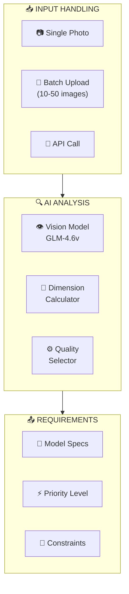
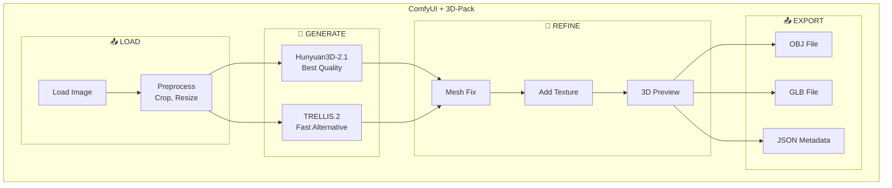
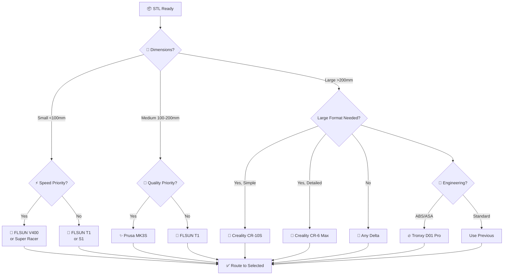
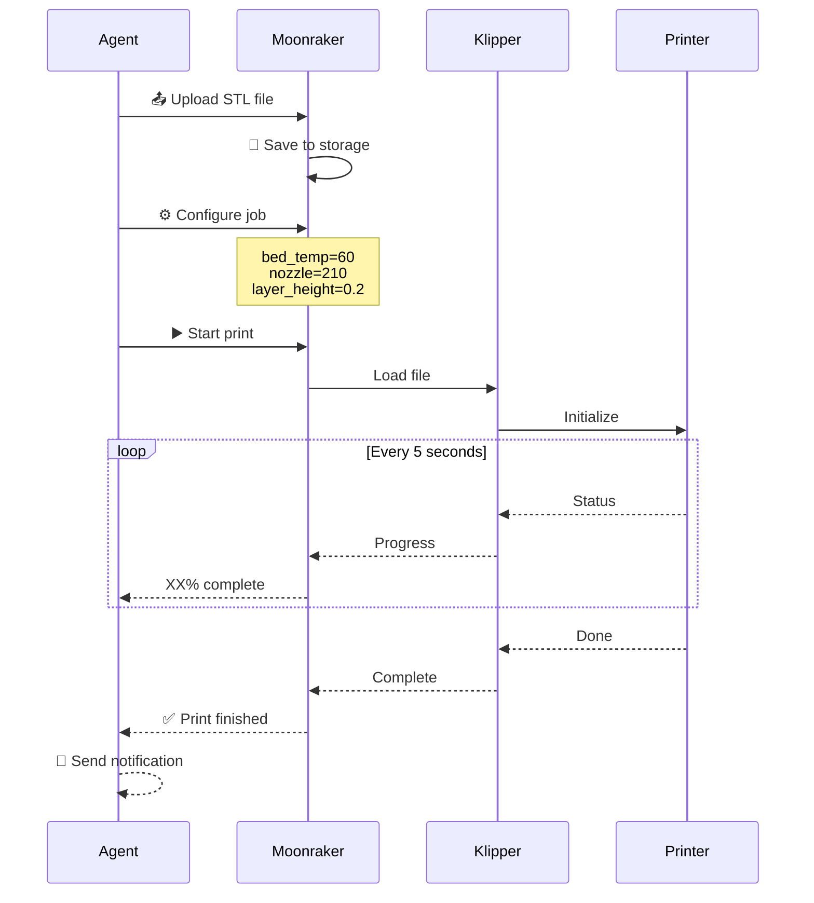
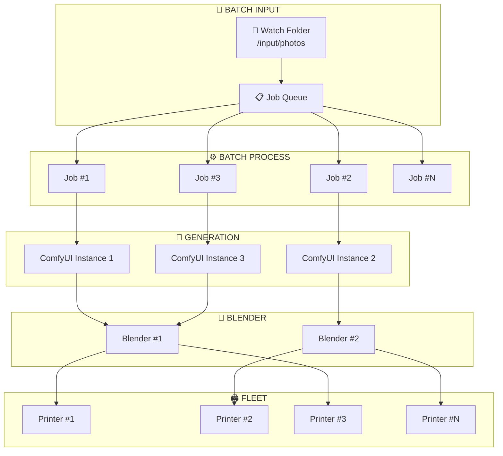
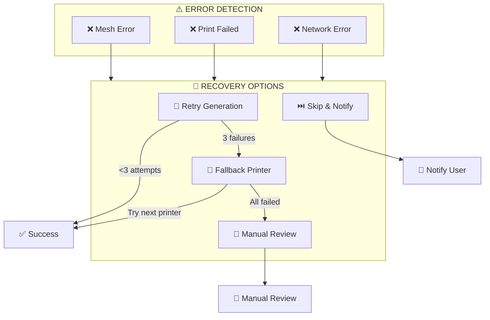

# 03 - End-to-End Workflow

## Complete Production Pipeline

```mermaid
sequenceDiagram
    autonumber
    participant User
    participant Agent
    participant ComfyUI
    participant Blender
    participant Router
    participant Moonraker
    participant Printer

    rect rgb(40, 60, 80)
        Note over User,Printer: PHASE 1: INPUT & ANALYSIS
        User->>Agent: 📷 Upload photo(s)
        User->>Agent: 📝 Instructions (size, material, quality)
        Agent->>Agent: 🤖 Analyze requirements
        Agent->>Agent: 📐 Calculate dimensions
    end

    rect rgb(60, 40, 60)
        Note over User,Printer: PHASE 2: 3D GENERATION
        Agent->>ComfyUI: 🎨 Send to ComfyUI
        ComfyUI->>ComfyUI: 🔍 Preprocess image
        alt High Fidelity Mode
            ComfyUI->>ComfyUI: 🎯 Hunyuan3D-2.1
        else Fast Mode
            ComfyUI->>ComfyUI: ⚡ TRELLIS.2
        end
        ComfyUI-->>Agent: 📦 OBJ/GLB file
    end

    rect rgb(40, 80, 60)
        Note over User,Printer: PHASE 3: POST-PROCESSING
        Agent->>Blender: 🔧 Run repair script
        Blender->>Blender: ✓ Check manifold
        Blender->>Blender: 🔨 Fix holes/edges
        Blender->>Blender: 📏 Add solidify (2.5mm)
        Blender->>Blender: 🧹 3D Print check
        Blender-->>Agent: 📄 STL ready
    end

    rect rgb(80, 60, 40)
        Note over User,Printer: PHASE 4: ROUTING & QUEUING
        Agent->>Router: 🗺️ Route to optimal printer
        Router->>Router: 📊 Check fleet status
        Router->>Router: ⚖️ Apply routing rules
        Router-->>Agent: 🖨️ Selected: [Printer Name]
        Agent->>Moonraker: 📤 Upload STL
        Agent->>Moonraker: ⚙️ Set print parameters
        Agent->>Moonraker: ▶️ Start print
    end

    rect rgb(40, 40, 80)
        Note over User,Printer: PHASE 5: MONITORING
        Moonraker->>Printer: 🖥️ Execute print
        loop Print Progress
            Printer-->>Moonraker: 📊 Status update
            Moonraker-->>Agent: 📈 Progress: XX%
        end
        Printer-->>Moonraker: ✅ Print complete
        Moonraker-->>Agent: 🎉 Done!
        Agent-->>User: 📱 Notification
    end
```

---

## Detailed Step Breakdown

### Phase 1: Input & Analysis

| Step | Action | Tool | Output |
|------|--------|------|--------|
| 1.1 | Upload image(s) | Agent / API | Raw images |
| 1.2 | Vision analysis | GLM-4.6v | Object type, complexity |
| 1.3 | Dimension calc | Qwen2.5-Coder | Target size in mm |
| 1.4 | Quality select | Agent | Quality preset |

---

### Phase 2: 3D Generation

| Mode | Model | VRAM | Time | Quality |
|------|-------|------|------|---------|
| **Quality** | Hunyuan3D-2.1 | 18-22 GB | 3-6 min | ⭐⭐⭐⭐⭐ |
| **Fast** | TRELLIS.2 | 12-16 GB | 1-3 min | ⭐⭐⭐⭐ |
| **Turbo** | TRELLIS.2 + low-res | 8-10 GB | 30-60s | ⭐⭐⭐ |

---

### Phase 3: Post-Processing (Blender)

```mermaid
flowchart TB
    subgraph Blender_Workflow["Blender Python Pipeline"]
        
        subgraph Import["📥 IMPORT"]
            Load["Load OBJ/GLB"]
            Validate["Validate Mesh"]
        end

        subgraph Analyze["🔍 ANALYZE"]
            Check["Check Issues<br/>Holes, Normals, Non-manifold"]
            Report["Generate Report"]
        end

        subgraph Fix["🔧 FIX"]
            FixHoles["Fill Holes"]
            Recalc["Recalculate Normals"]
            Clean["Clean Geometry"]
        end

        subgraph Prepare["📏 PREPARE FOR PRINT"]
            Solidify["Solidify Modifier<br/>2.5mm thickness"]
            Bevel["Add Bevel<br/>(optional)"]
            Check["3D Print Toolbox<br/>Check All"]
        end

        subgraph Export["📤 EXPORT"]
            STL["Export STL"]
            Config["Generate Print Config"]
        end

        Load --> Validate
        Validate --> Analyze
        Analyze --> Fix
        Fix --> Prepare
        Prepare --> Export
    end
```

| Step | Blender Operation | Duration | Purpose |
|------|-----------------|----------|---------|
| 3.1 | Import OBJ | 5-15s | Load generated mesh |
| 3.2 | Check manifold | 2-5s | Find issues |
| 3.3 | Fill holes | 5-30s | Make watertight |
| 3.4 | Solidify | 3-10s | Add wall thickness |
| 3.5 | 3D Print check | 5-15s | Final validation |
| 3.6 | Export STL | 3-10s | Ready for slicer |

---

### Phase 4: Fleet Routing

| Model Size | Delta/FLSUN | Cartesian | Special |
|------------|-------------|-----------|---------|
| **Miniature** (<50mm) | V400, T1 | - | Turbo mode |
| **Small** (50-100mm) | T1, S1 | MK3S | Standard |
| **Medium** (100-200mm) | S1, Super Racer | CR-6 Max | Standard |
| **Large** (200-300mm) | - | CR-10S, X5SA | Large mode |
| **XL** (>300mm) | - | X5SA Pro | XL mode |
| **ABS/Engineering** | - | D01 Pro | Enclosed |

---

### Phase 5: Print Job Execution

---

## Batch Processing Workflow

### Batch Settings

| Parameter | Value | Notes |
|-----------|-------|-------|
| **Max concurrent generation** | 2-3 | VRAM limited |
| **Max concurrent Blender** | 2 | CPU limited |
| **Max concurrent prints** | 11 | Full fleet |
| **Queue priority** | FIFO + VIP | Priority override |

---

## Error Handling & Recovery

---

## SLA & Timing

| Phase | Typical | Max | SLA |
|-------|---------|-----|-----|
| 3D Generation | 2-4 min | 8 min | 99% |
| Blender Processing | 1-2 min | 5 min | 99% |
| Fleet Routing | 5-10s | 30s | 99.9% |
| Print Start | 30s | 2 min | 99% |
| **Total (excluding print)** | 4-7 min | 15 min | 99% |
