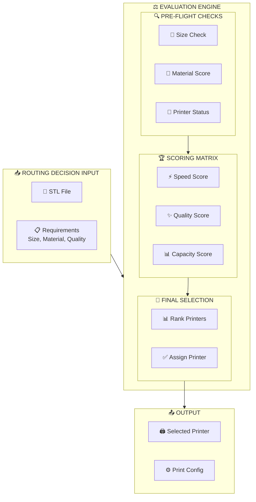
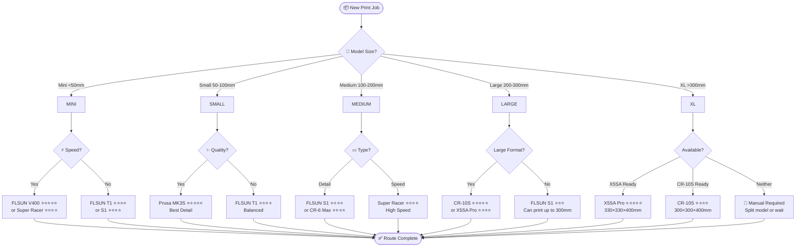
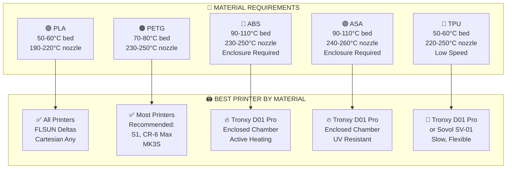
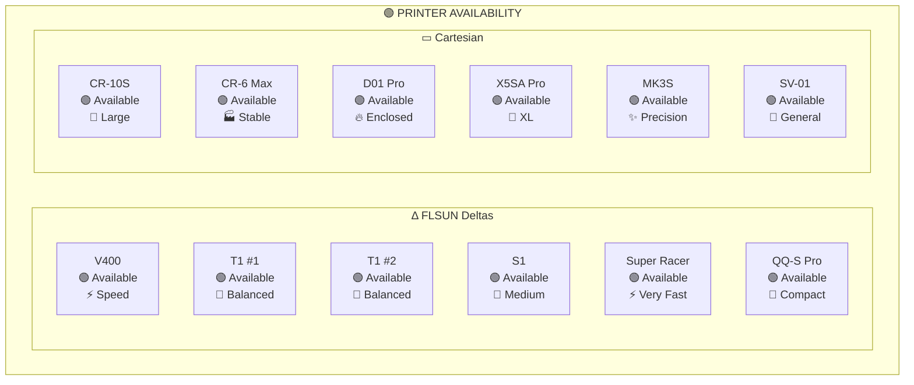

# 04 - Fleet Routing

## Intelligent Printer Selection System



---

## Decision Flowchart



---

## Material-Based Routing



---

## Printer Availability Matrix



| Status | Code | Meaning | Can Route? |
|--------|------|---------|-----------|
| 🟢 Available | `available` | Idle, ready | ✅ Yes |
| 🟡 Busy | `printing` | Currently printing | ⚠️ Check ETA |
| 🔴 Error | `error` | Problem detected | ❌ No |
| 🔵 Maintenance | `maintenance` | Needs attention | ❌ No |

---

## Priority Scoring Algorithm


### Scoring Formula

```
Score = (SizeScore × 0.30) + (MaterialScore × 0.20) + (QualityScore × 0.25) + (TimeScore × 0.15) + (AvailScore × 0.10)
```

### Score Ranges

| Score | Meaning | Action |
|-------|---------|--------|
| **90-100** | Perfect match | Assign immediately |
| **70-89** | Good match | Assign if no perfect |
| **50-69** | Acceptable | Fallback option |
| **<50** | Poor match | Manual review needed |

---

## Configuration File (routing-rules.yaml)

```yaml
# Printer Routing Rules Configuration
# Location: /config/routing-rules.yaml

printers:
  flsun_v400:
    type: delta
    kinematics: delta
    build_volume: [300, 300]  # mm
    max_speed: 300  # mm/s
    qualities: [low, medium]
    materials: [pla, petg]
    enclosure: false
    priority: 10
    tags: [speed, miniature, prototype]

  flsun_t1:
    type: delta
    kinematics: delta
    build_volume: [300, 400]
    max_speed: 250
    qualities: [medium, high]
    materials: [pla, petg]
    enclosure: false
    priority: 9
    tags: [balanced, general]

  flsun_t1_2:
    type: delta
    kinematics: delta
    build_volume: [300, 400]
    max_speed: 250
    qualities: [medium, high]
    materials: [pla, petg]
    enclosure: false
    priority: 9
    tags: [balanced, general]

  flsun_s1:
    type: delta
    kinematics: delta
    build_volume: [300, 400]
    max_speed: 250
    qualities: [medium, high]
    materials: [pla, petg, abs]
    enclosure: false
    priority: 8
    tags: [medium, versatile]

  flsun_super_racer:
    type: delta
    kinematics: delta
    build_volume: [300, 400]
    max_speed: 300
    qualities: [low, medium]
    materials: [pla, petg]
    enclosure: false
    priority: 10
    tags: [speed, prototype]

  flsun_qqsp:
    type: delta
    kinematics: delta
    build_volume: [255, 300]
    max_speed: 250
    qualities: [medium]
    materials: [pla, petg]
    enclosure: false
    priority: 7
    tags: [compact, delta]

  creality_cr10s:
    type: cartesian
    kinematics: xyz
    build_volume: [300, 300, 400]
    max_speed: 100
    qualities: [high]
    materials: [pla, petg, abs]
    enclosure: false
    priority: 8
    tags: [large, flat]

  creality_cr6max:
    type: cartesian
    kinematics: xyz
    build_volume: [300, 300, 400]
    max_speed: 100
    qualities: [high]
    materials: [pla, petg, abs]
    enclosure: false
    priority: 8
    tags: [large, stable]

  tronxy_d01:
    type: cartesian
    kinematics: xyz
    build_volume: [220, 220, 250]
    max_speed: 80
    qualities: [high]
    materials: [pla, petg, abs, asa, tpu]
    enclosure: true
    priority: 9
    tags: [engineering, enclosed]

  tronxy_x5sa:
    type: cartesian
    kinematics: xyz
    build_volume: [330, 330, 400]
    max_speed: 80
    qualities: [high]
    materials: [pla, petg, abs]
    enclosure: false
    priority: 8
    tags: [xl, large]

  prusa_mk3s:
    type: cartesian
    kinematics: xyz
    build_volume: [250, 210, 210]
    max_speed: 100
    qualities: [maximum]
    materials: [pla, petg, abs]
    enclosure: false
    priority: 10
    tags: [precision, detail, quality]

  sovol_sv01:
    type: cartesian
    kinematics: xyz
    build_volume: [280, 280, 320]
    max_speed: 80
    qualities: [medium, high]
    materials: [pla, petg, abs, tpu]
    enclosure: false
    priority: 6
    tags: [general, testing]

# Routing Rules
rules:
  # Size-based routing
  size_thresholds:
    miniature: 50   # mm
    small: 100
    medium: 200
    large: 300
    xl: 330

  # Material requirements
  material_requirements:
    abs:
      requires_enclosure: true
      preferred_printers: [tronxy_d01]
    asa:
      requires_enclosure: true
      preferred_printers: [tronxy_d01]
    tpu:
      requires_flexible: true
      preferred_printers: [tronxy_d01, sovol_sv01]
    pla:
      preferred_printers: [all]

  # Quality mapping
  quality_presets:
    maximum:
      preferred_printers: [prusa_mk3s]
      layer_height: 0.05
    high:
      preferred_printers: [prusa_mk3s, flsun_s1, cr6max]
      layer_height: 0.12
    medium:
      preferred_printers: [fllsun_t1, flsun_s1]
      layer_height: 0.20
    low:
      preferred_printers: [fllsun_v400, super_racer]
      layer_height: 0.28
```

---

## Router API Endpoints

| Endpoint | Method | Description |
|----------|--------|-------------|
| `/api/route` | POST | Get best printer for STL |
| `/api/fleet-status` | GET | All printer statuses |
| `/api/queue` | GET | Current job queue |
| `/api/assign/{job_id}` | POST | Assign job to printer |
| `/api/rules` | GET/PUT | Routing rules config |

---

## Example Routing Request

```json
{
  "model": {
    "file": "/output/model.stl",
    "dimensions": {
      "x": 150,
      "y": 200,
      "z": 80
    },
    "volume_cm3": 2400
  },
  "requirements": {
    "material": "pla",
    "quality": "high",
    "time_priority": "normal",
    "enclosure_required": false
  }
}
```

## Example Routing Response

```json
{
  "recommended": {
    "printer": "fllsun_s1",
    "score": 94,
    "estimated_time": "45 minutes",
    "config": {
      "layer_height": 0.12,
      "nozzle_temp": 210,
      "bed_temp": 60
    }
  },
  "alternatives": [
    {
      "printer": "fllsun_t1_1",
      "score": 88,
      "estimated_time": "42 minutes"
    },
    {
      "printer": "creality_cr6max",
      "score": 82,
      "estimated_time": "65 minutes"
    }
  ]
}
```
