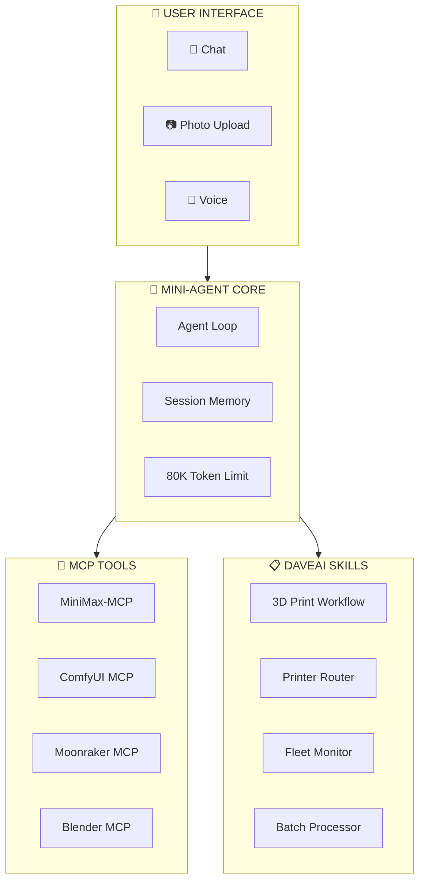
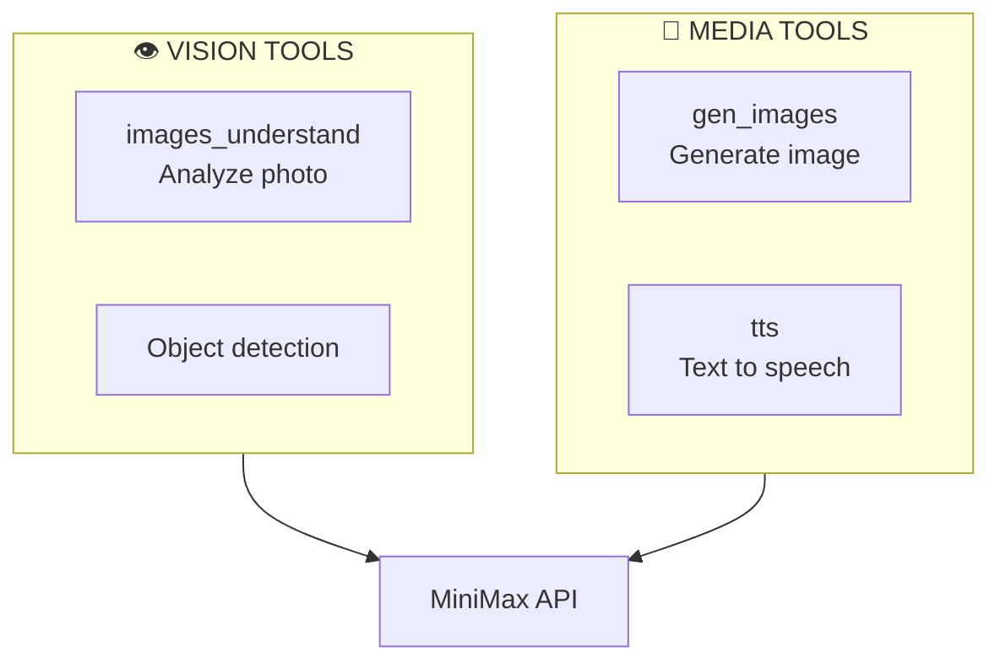
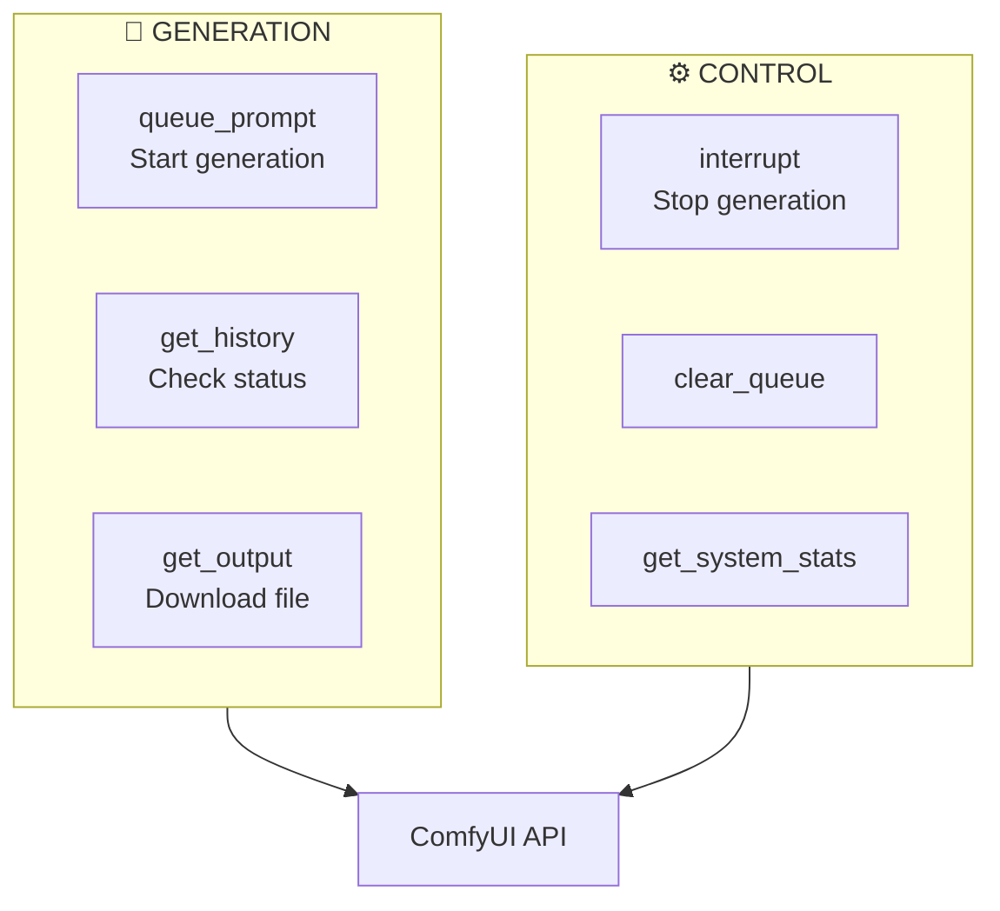
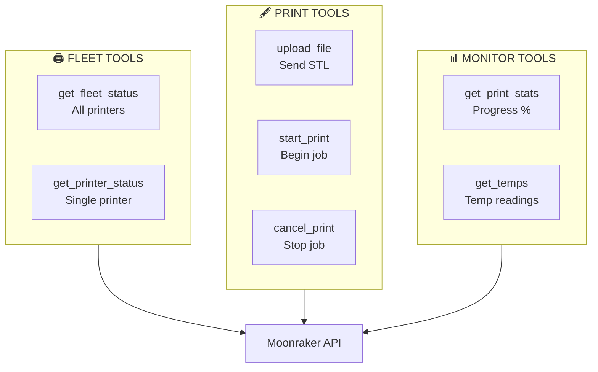
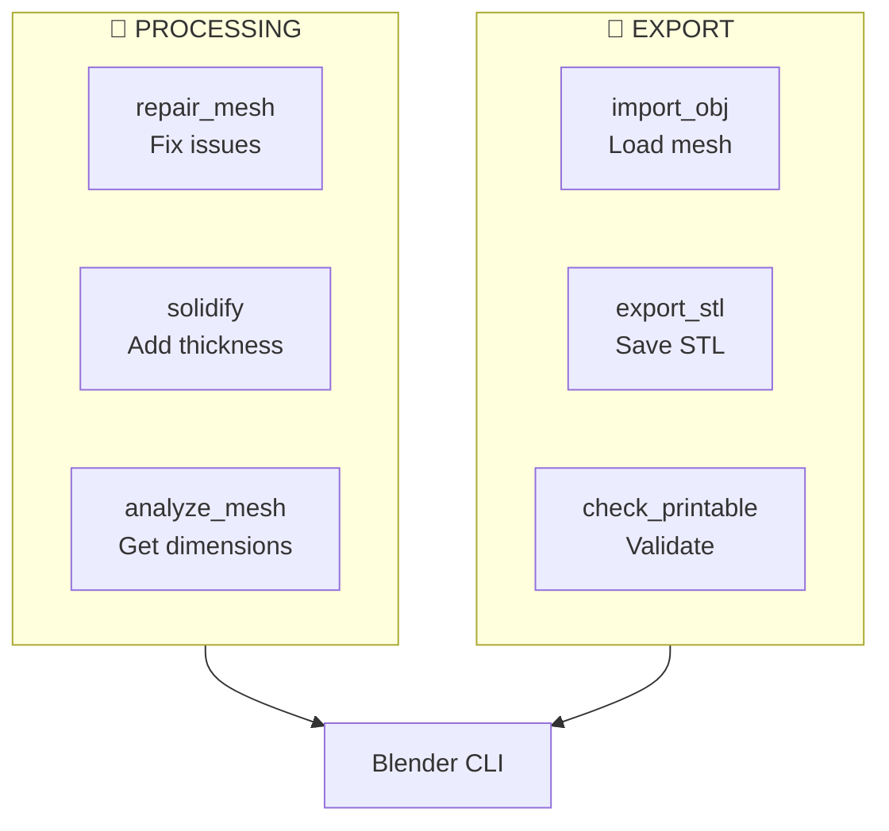
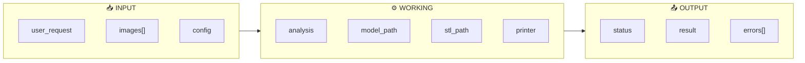
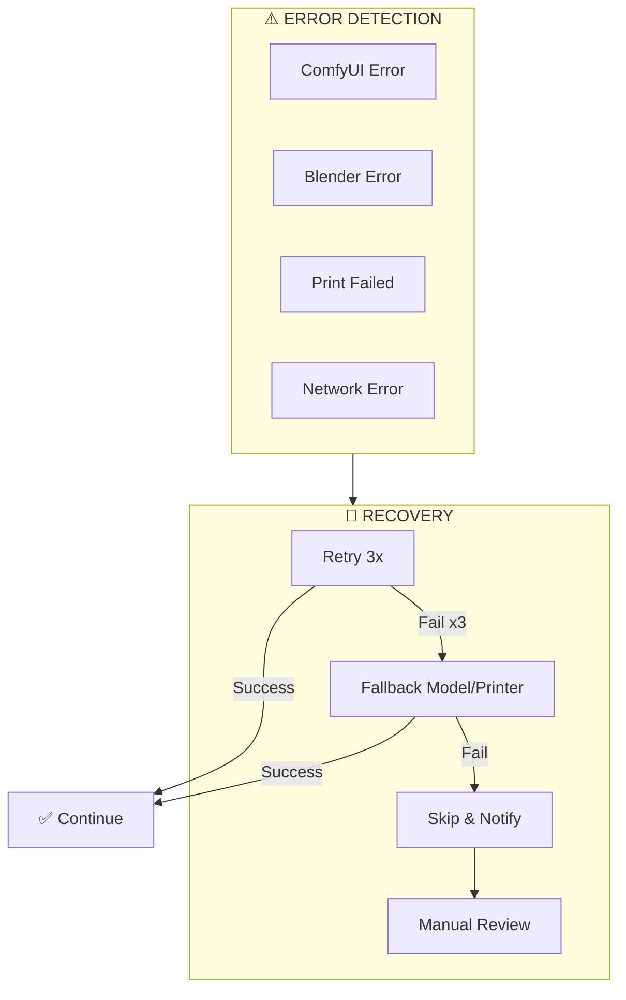
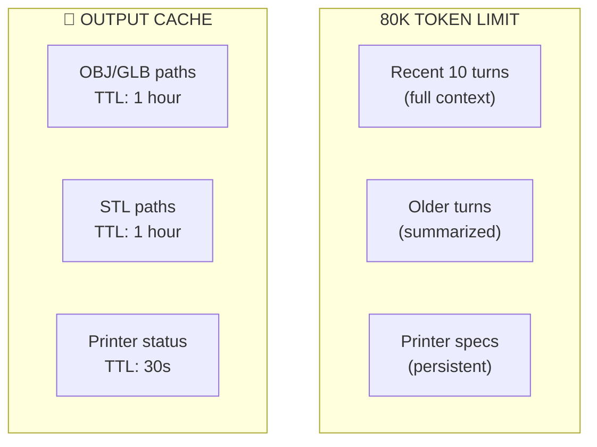

# 05 - Agentic System

## DaveAI Agent Architecture

Built on **Mini-Agent** with custom skills and MCP integrations.



---

## Mini-Agent Integration

DaveAI is built on Mini-Agent with these customizations:

### Configuration

```yaml
# config/config.yaml
api_key: "${MINIMAX_API_KEY}"
api_base: "https://api.minimax.io"
model: "MiniMax-M2.5"
provider: "anthropic"

max_steps: 100
workspace_dir: "./workspace"

tools:
  enable_file_tools: true
  enable_bash: true
  enable_skills: true
  skills_dir: "./skills"
  enable_mcp: true
  mcp_config_path: "mcp.json"
```

### MCP Configuration

```json
{
  "mcpServers": {
    "minimax": {
      "command": "npx",
      "args": ["-y", "@minimax-ai/mcp-server"]
    },
    "comfyui": {
      "command": "python",
      "args": ["-m", "mcp.comfyui-mcp"]
    },
    "moonraker": {
      "type": "streamable_http",
      "url": "http://mainsail.local:7125"
    },
    "blender": {
      "command": "blender",
      "args": ["--background", "--python", "./mcp/blender-mcp"]
    }
  }
}
```

---

## Tool Definitions

### MiniMax-MCP Tools



| Tool | Input | Output | Use Case |
|------|-------|--------|----------|
| `images_understand` | image file/url | analysis JSON | Photo analysis |
| `gen_images` | prompt | image path | Reference generation |
| `tts` | text | audio file | Voice notifications |

### ComfyUI MCP Tools



| Tool | Input | Output | Use Case |
|------|-------|--------|----------|
| `comfyui_queue_prompt` | workflow JSON | prompt_id | Start 3D gen |
| `comfyui_get_history` | prompt_id | status dict | Track progress |
| `comfyui_get_output` | filename | file bytes | Get OBJ/GLB |

### Moonraker MCP Tools



| Tool | Input | Output | Use Case |
|------|-------|--------|----------|
| `moonraker_get_fleet_status` | - | printer list | Fleet overview |
| `moonraker_upload_file` | file_path | success | Send STL |
| `moonraker_start_print` | filename | job started | Execute print |
| `moonraker_get_print_stats` | printer | progress % | Monitor print |

### Blender MCP Tools



| Tool | Input | Output | Use Case |
|------|-------|--------|----------|
| `blender_repair_mesh` | obj_path | repaired path | Fix mesh |
| `blender_solidify` | obj_path, thickness | solidified | Add walls |
| `blender_export_stl` | obj_path, output | stl_path | Final export |
| `blender_check_printable` | obj_path | report | Validation |

---

## Skills System

### Skill Loading

Skills are loaded from `skills/` directory. Each skill is a folder with `SKILL.md`.

```python
# From mini_agent/tools/skill_loader.py
class SkillLoader:
    def load_skill(self, skill_path: Path):
        skill_md = skill_path / "SKILL.md"
        # Parse YAML frontmatter
        # Load into agent context
```

### Skill Structure

```
skills/
├── 3d-print-workflow/
│   └── SKILL.md          # Main workflow skill
├── printer-router/
│   └── SKILL.md          # Routing decisions
├── fleet-monitor/
│   └── SKILL.md          # Status monitoring
└── batch-processor/
    └── SKILL.md          # Queue management
```

### Skill Format

```markdown
---
name: skill-name
description: When to use this skill
---

# Skill Name

## Instructions for the agent
```

---

## Agent State



### State Fields

| Field | Type | Description |
|-------|------|-------------|
| `user_request` | str | Original user request |
| `images` | List[Path] | Input photos |
| `analysis` | dict | Vision model output |
| `model_path` | Path | Generated OBJ file |
| `stl_path` | Path | Processed STL file |
| `printer` | str | Selected printer name |
| `status` | str | Current status |
| `errors` | List[str] | Any errors encountered |

---

## Error Recovery



### Recovery Strategies

| Error | Strategy 1 | Strategy 2 | Strategy 3 |
|-------|-----------|------------|-----------|
| ComfyUI | Retry 3x | Switch model | Skip job |
| Blender | Retry repair | Manual fix | Skip job |
| Print fail | Retry same | Fallback printer | Manual |
| Network | Reconnect | Wait 30s | Notify user |

---

## Context Management



---

## Supervisor System Prompt

```markdown
# DaveAI - 3D Print Factory Agent

You are DaveAI, operator of an autonomous 3D print factory.

## Your Capabilities
1. Analyze photos with vision AI
2. Generate 3D models via ComfyUI
3. Process meshes with Blender
4. Control 11 printers via Moonraker
5. Route jobs intelligently

## Your Fleet
- 5x FLSUN Delta (speed)
- 6x Cartesian (precision/size)
- All Klipper + Moonraker

## Workflow
1. Receive photo + instructions
2. Analyze with vision
3. Generate 3D
4. Process mesh
5. Route to printer
6. Monitor & notify

## Always
- Check printer availability
- Verify STL is valid
- Monitor first layer
- Report progress frequently
```

---

## API Endpoints (Optional REST API)

| Endpoint | Method | Description |
|----------|--------|-------------|
| `/api/chat` | POST | Chat with agent |
| `/api/generate` | POST | Generate from image |
| `/api/status/{job_id}` | GET | Job status |
| `/api/fleet` | GET | Fleet overview |
| `/api/queue` | GET | Job queue |

---

## Running DaveAI

```bash
# Install dependencies
cd 3d-printer-daveai
uv sync

# Configure
cp config/config-example.yaml config/config.yaml
# Edit config.yaml with your API keys

# Start agent
uv run python -m mini_agent.cli --config config/config.yaml

# Or with custom prompt
uv run python -m mini_agent.cli --system-prompt config/system_prompt.md
```

---

## Session Memory

DaveAI maintains session notes for context:

```
.workspace/
├── session_notes.md    # Persistent facts
├── job_history.md     # Print history
└── fleet_state.md     # Current printer states
```

Notes are updated after each print job for continuity.
