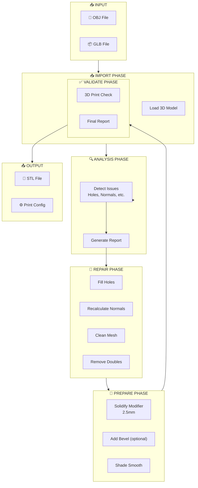
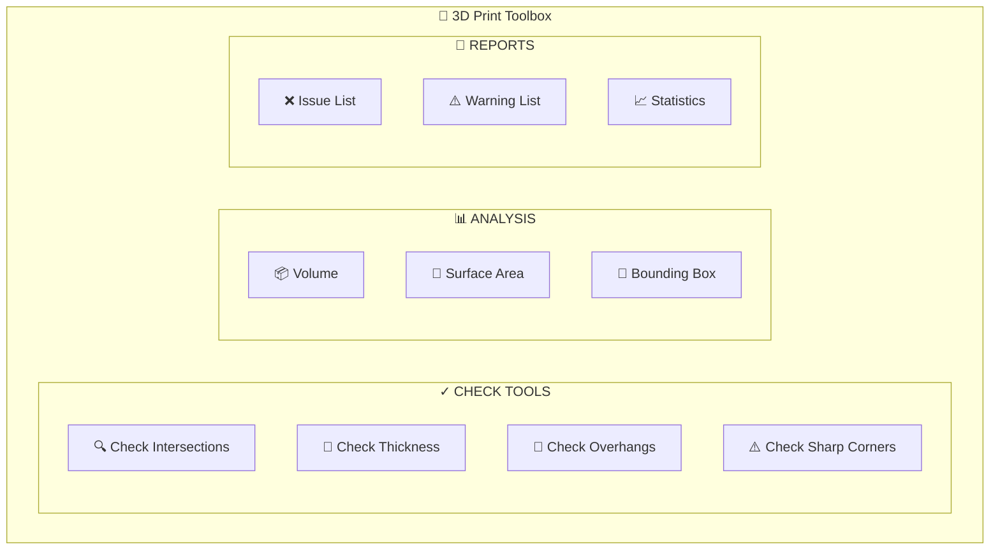
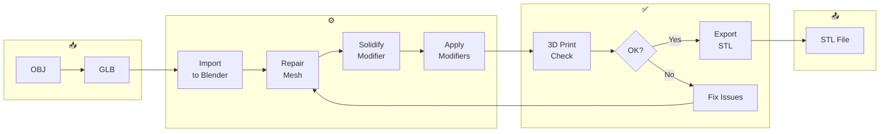

# 06 - Blender Automation

## Blender Pipeline Overview



---

## Python Scripts

### 1. Auto Solidify Script (auto-solidify.py)

```python
#!/usr/bin/env python3
"""
auto-solidify.py - Automated mesh solidification for 3D printing

Usage:
    blender --background --python auto-solidify.py -- <input.obj> <output.stl> [thickness]
    
Example:
    blender --background --python auto-solidify.py -- input.obj output.stl 2.5
"""

import bpy
import sys
import os
from pathlib import Path

def clear_scene():
    """Remove all objects from the scene"""
    bpy.ops.object.select_all(action='SELECT')
    bpy.ops.object.delete(use_global=False)
    
    # Clear orphan data
    for block in bpy.data.meshes:
        if block.users == 0:
            bpy.data.meshes.remove(block)

def import_model(filepath):
    """Import 3D model based on file extension"""
    clear_scene()
    
    ext = Path(filepath).suffix.lower()
    
    if ext == '.obj':
        bpy.ops.import_scene.obj(filepath=filepath)
    elif ext in ['.glb', '.gltf']:
        bpy.ops.import_scene.gltf(filepath=filepath)
    elif ext == '.stl':
        bpy.ops.import_mesh.stl(filepath=filepath)
    else:
        raise ValueError(f"Unsupported format: {ext}")
    
    # Select the imported object
    obj = bpy.context.selected_objects[0]
    bpy.context.view_layer.objects.active = obj
    return obj

def analyze_mesh(obj):
    """Analyze mesh for printing issues"""
    issues = []
    
    # Check for non-manifold edges
    bm_mode = bpy.context.object.mode
    bpy.ops.object.mode_set(mode='EDIT')
    bpy.ops.mesh.select_non_manifold()
    
    mesh = obj.data
    bm = bmesh.from_edit_mesh(mesh)
    non_manifold = [v for v in bm.verts if not v.is_manifold]
    
    if non_manifold:
        issues.append(f"Non-manifold edges found: {len(non_manifold)}")
    
    bpy.ops.mesh.select_all(action='DESELECT')
    bpy.ops.object.mode_set(mode=bm_mode)
    
    return issues

def repair_mesh(obj):
    """Basic mesh repairs"""
    # Enter edit mode
    bpy.ops.object.mode_set(mode='EDIT')
    bpy.ops.mesh.select_all(action='SELECT')
    
    # Remove doubles
    bpy.ops.mesh.remove_doubles(threshold=0.0001)
    
    # Recalculate normals
    bpy.ops.mesh.normals_make_consistent(inside=False)
    
    # Fill holes (simple)
    bpy.ops.mesh.fill_holes()
    
    # Return to object mode
    bpy.ops.object.mode_set(mode='OBJECT')
    
    print("Mesh repaired successfully")

def add_solidify(obj, thickness=2.5):
    """Add solidify modifier with specified thickness"""
    # Select object
    bpy.context.view_layer.objects.active = obj
    obj.select_set(True)
    
    # Add solidify modifier
    solidify = obj.modifiers.new(name="Solidify", type='SOLIDIFY')
    solidify.thickness = thickness / 1000  # Convert mm to meters
    solidify.offset = 0
    solidify.use_even_offset = True
    solidify.use_quality_normals = True
    solidify.use_rim = False
    
    # Apply modifier
    bpy.ops.object.modifier_apply(modifier="Solidify")
    
    print(f"Solidify applied: {thickness}mm")

def export_stl(obj, output_path):
    """Export as STL file"""
    bpy.ops.export_mesh.stl(
        filepath=output_path,
        use_selection=True,
        global_scale=1.0,
        use_mesh_modifiers=True
    )
    print(f"Exported: {output_path}")

def main():
    # Parse arguments
    args = sys.argv[sys.argv.index("--") + 1:]
    
    if len(args) < 2:
        print("Usage: blender --background --python auto-solidify.py -- <input> <output> [thickness]")
        sys.exit(1)
    
    input_path = args[0]
    output_path = args[1]
    thickness = float(args[2]) if len(args) > 2 else 2.5
    
    print(f"Processing: {input_path}")
    print(f"Output: {output_path}")
    print(f"Thickness: {thickness}mm")
    
    # Import
    obj = import_model(input_path)
    print(f"Imported: {obj.name}")
    
    # Analyze
    issues = analyze_mesh(obj)
    if issues:
        print("Issues found:")
        for issue in issues:
            print(f"  - {issue}")
    
    # Repair
    repair_mesh(obj)
    
    # Solidify
    add_solidify(obj, thickness)
    
    # Export
    export_stl(obj, output_path)
    
    print("Done!")

if __name__ == "__main__":
    main()
```

---

### 2. Mesh Repair Script (mesh-repair.py)

```python
#!/usr/bin/env python3
"""
mesh-repair.py - Comprehensive mesh repair for 3D printing

Features:
- Fill holes
- Remove doubles
- Fix normals
- Fix non-manifold geometry
- Dissolve degenerate
"""

import bpy
import bmesh
import sys
from pathlib import Path

def get_bmesh(obj):
    """Get bmesh from object"""
    bm = bmesh.new()
    bm.from_mesh(obj.data)
    return bm

def repair_holes(bm):
    """Fill all holes in mesh"""
    holes = []
    for face in bm.faces:
        if face.is_valid:
            for loop in face.loops:
                edge = loop.edge
                if not edge.is_boundary:
                    continue
                # Check if edge is part of only one face
                if len(edge.link_faces) == 1:
                    holes.append(edge)
    
    # Fill holes with triangles
    filled = 0
    for edge in set(holes):
        try:
            bmesh.ops.fill_holes(bm, edges=[edge])
            filled += 1
        except:
            pass
    
    return filled

def remove_doubles(bm, threshold=0.0001):
    """Remove duplicate vertices"""
    removed = bmesh.ops.remove_doubles(bm, verts=bm.verts, dist=threshold)
    return len(removed.get('pan', []))

def recalculate_normals(bm, inside=False):
    """Recalculate all normals"""
    bmesh.ops.recalc.normals(bm, faces=bm.faces)

def dissolve_degenerate(bm, threshold=0.0001):
    """Dissolve degenerate edges and faces"""
    dissolved = bmesh.ops.dissolve_degenerate(bm, 
                                               edges=bm.edges, 
                                               dist=threshold)
    return len(dissolved.get('edges', []))

def dissolve_loose(bm):
    """Remove loose vertices and edges"""
    dissolved = bmesh.ops.dissolve_loose(bm, verts=bm.verts)
    return len(dissolved.get('verts', []))

def fix_non_manifold(bm):
    """Attempt to fix non-manifold geometry"""
    # Select non-manifold vertices
    non_manifold_verts = [v for v in bm.verts if not v.is_manifold]
    
    for v in non_manifold_verts:
        # Try to remove if isolated
        if len(v.link_edges) == 0:
            bm.verts.remove(v)
        # Try to dissolve vertex
        elif len(v.link_edges) <= 2:
            try:
                bmesh.ops.dissolve_vert(bm, verts=[v])
            except:
                pass
    
    return len(non_manifold_verts)

def check_mesh_health(obj):
    """Generate mesh health report"""
    report = {
        'total_verts': len(obj.data.vertices),
        'total_edges': len(obj.data.edges),
        'total_faces': len(obj.data.polygons),
        'issues': []
    }
    
    bm = get_bmesh(obj)
    
    # Check for non-manifold
    non_manifold = [v for v in bm.verts if not v.is_manifold]
    if non_manifold:
        report['issues'].append(f"Non-manifold vertices: {len(non_manifold)}")
    
    # Check for degenerate faces
    degenerate = [f for f in bm.faces if f.area < 0.0001]
    if degenerate:
        report['issues'].append(f"Degenerate faces: {len(degenerate)}")
    
    # Check for holes (boundary edges not on face boundary)
    boundary_count = sum(1 for e in bm.edges if e.is_boundary)
    if boundary_count > 0:
        report['issues'].append(f"Boundary edges (holes): {boundary_count}")
    
    bm.free()
    return report

def full_repair(obj):
    """Run full repair pipeline"""
    bm = get_bmesh(obj)
    
    print("Starting mesh repair...")
    
    # Step 1: Dissolve degenerate
    deg = dissolve_degenerate(bm)
    print(f"  Dissolved degenerate: {deg}")
    
    # Step 2: Remove doubles
    doubles = remove_doubles(bm)
    print(f"  Removed doubles: {doubles}")
    
    # Step 3: Fix non-manifold
    manifold = fix_non_manifold(bm)
    print(f"  Fixed non-manifold: {manifold}")
    
    # Step 4: Fill holes
    holes = repair_holes(bm)
    print(f"  Filled holes: {holes}")
    
    # Step 5: Recalculate normals
    recalculate_normals(bm)
    print("  Normals recalculated")
    
    # Write back to mesh
    bm.to_mesh(obj.data)
    obj.data.update()
    bm.free()
    
    print("Repair complete!")

def main():
    args = sys.argv[sys.argv.index("--") + 1:]
    
    if len(args) < 2:
        print("Usage: blender --background --python mesh-repair.py -- <input> <output>")
        sys.exit(1)
    
    input_path = args[0]
    output_path = args[1]
    
    # Import
    ext = Path(input_path).suffix.lower()
    if ext == '.obj':
        bpy.ops.import_scene.obj(filepath=input_path)
    elif ext in ['.glb', '.gltf']:
        bpy.ops.import_scene.gltf(filepath=input_path)
    elif ext == '.stl':
        bpy.ops.import_mesh.stl(filepath=input_path)
    
    obj = bpy.context.selected_objects[0]
    
    # Health check
    report = check_mesh_health(obj)
    print("\n=== MESH HEALTH REPORT ===")
    print(f"Vertices: {report['total_verts']}")
    print(f"Edges: {report['total_edges']}")
    print(f"Faces: {report['total_faces']}")
    if report['issues']:
        print("Issues found:")
        for issue in report['issues']:
            print(f"  - {issue}")
    else:
        print("No issues found!")
    
    # Repair
    full_repair(obj)
    
    # Export
    bpy.ops.export_mesh.stl(filepath=output_path, use_selection=True)
    print(f"Exported: {output_path}")

if __name__ == "__main__":
    main()
```

---

### 3. Batch Export Script (batch-export.py)

```python
#!/usr/bin/env python3
"""
batch-export.py - Batch process multiple OBJ files

Usage:
    blender --background --python batch-export.py -- <input_dir> <output_dir> [thickness]
"""

import bpy
import os
import sys
from pathlib import Path

def process_file(input_file, output_dir, thickness=2.5):
    """Process a single file"""
    filename = Path(input_file).stem
    output_file = os.path.join(output_dir, f"{filename}.stl")
    
    print(f"\n{'='*50}")
    print(f"Processing: {filename}")
    print(f"{'='*50}")
    
    # Clear scene
    bpy.ops.object.select_all(action='SELECT')
    bpy.ops.object.delete(use_global=False)
    
    # Import
    ext = Path(input_file).suffix.lower()
    if ext == '.obj':
        bpy.ops.import_scene.obj(filepath=input_file)
    elif ext in ['.glb', '.gltf']:
        bpy.ops.import_scene.gltf(filepath=input_file)
    elif ext == '.stl':
        bpy.ops.import_mesh.stl(filepath=input_file)
    else:
        print(f"Skipping unsupported: {ext}")
        return False
    
    obj = bpy.context.selected_objects[0]
    print(f"Imported: {obj.name}")
    
    # Basic repair
    bpy.ops.object.mode_set(mode='EDIT')
    bpy.ops.mesh.select_all(action='SELECT')
    bpy.ops.mesh.remove_doubles(threshold=0.0001)
    bpy.ops.mesh.normals_make_consistent(inside=False)
    bpy.ops.mesh.select_all(action='SELECT')
    bpy.ops.mesh.fill_holes()
    bpy.ops.object.mode_set(mode='OBJECT')
    
    # Solidify
    solidify = obj.modifiers.new(name="Solidify", type='SOLIDIFY')
    solidify.thickness = thickness / 1000
    solidify.use_even_offset = True
    bpy.ops.object.modifier_apply(modifier="Solidify")
    print(f"Solidified: {thickness}mm")
    
    # Export
    bpy.ops.export_mesh.stl(filepath=output_file, use_selection=True)
    print(f"Exported: {output_file}")
    
    return True

def main():
    args = sys.argv[sys.argv.index("--") + 1:]
    
    if len(args) < 2:
        print("Usage: blender --background --python batch-export.py -- <input_dir> <output_dir> [thickness]")
        sys.exit(1)
    
    input_dir = args[0]
    output_dir = args[1]
    thickness = float(args[2]) if len(args) > 2 else 2.5
    
    # Create output directory
    os.makedirs(output_dir, exist_ok=True)
    
    # Find all 3D files
    extensions = ['.obj', '.glb', '.gltf', '.stl']
    files = []
    for ext in extensions:
        files.extend(Path(input_dir).glob(f"*{ext}"))
    
    print(f"Found {len(files)} files to process")
    print(f"Thickness: {thickness}mm")
    
    success = 0
    failed = 0
    
    for f in files:
        try:
            if process_file(str(f), output_dir, thickness):
                success += 1
            else:
                failed += 1
        except Exception as e:
            print(f"Error: {e}")
            failed += 1
    
    print(f"\n{'='*50}")
    print(f"BATCH COMPLETE")
    print(f"Success: {success}")
    print(f"Failed: {failed}")
    print(f"{'='*50}")

if __name__ == "__main__":
    main()
```

---

## 3D Print Toolbox Integration



---

## Command Line Usage

```bash
# Single file processing
blender --background --python auto-solidify.py -- input.obj output.stl 2.5

# Mesh repair only
blender --background --python mesh-repair.py -- input.obj output.stl

# Batch processing
blender --background --python batch-export.py -- ./input/ ./output/ 2.5

# With logging
blender --background --python auto-solidify.py -- input.obj output.stl 2.5 2>&1 | tee log.txt
```

---

## Configuration Presets

```yaml
# blender-presets.yaml
presets:
  miniature:
    thickness: 1.5  # mm
    bevel: 0.2
    quality: medium
    
  standard:
    thickness: 2.5
    bevel: 0.3
    quality: high
    
  engineering:
    thickness: 4.0
    bevel: 0.5
    quality: maximum
    infill: solid
    
  flexible:
    thickness: 3.0
    bevel: 0.4
    quality: high
    adjustment: tpu
```

---

## Script Workflow Diagram


