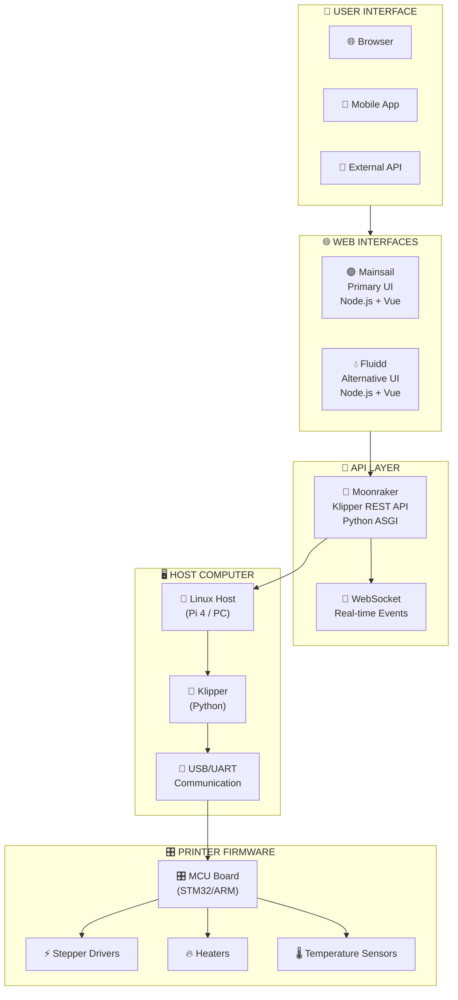
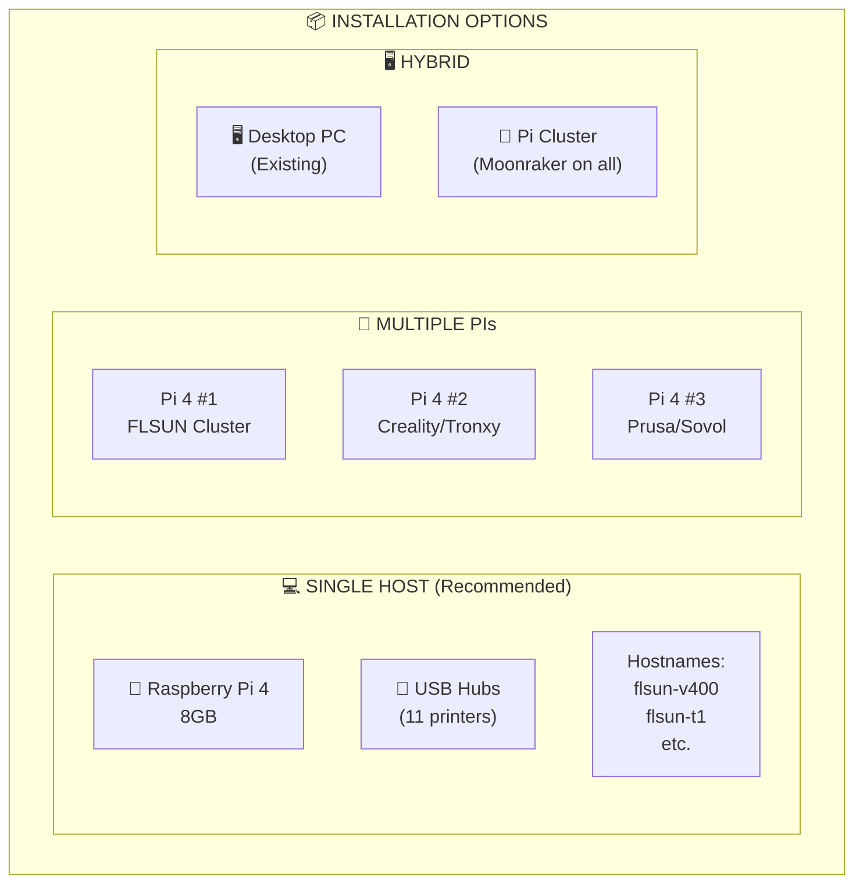
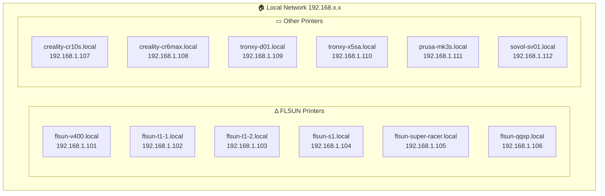
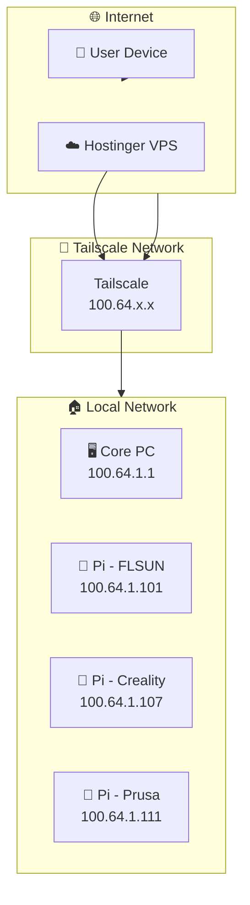

# 07 - Firmware & Interface Setup

## Klipper + Moonraker + Mainsail/Fluidd Architecture



---

## Fleet Installation Overview



---

## Moonraker Client (Python)

```python
#!/usr/bin/env python3
"""
moonraker_client.py - Python client for Moonraker/Klipper API
"""

import asyncio
import websockets
import json
import aiohttp
import os
from typing import Optional, Dict, Any

class MoonrakerClient:
    """Async Moonraker API client for fleet management"""
    
    def __init__(self, host: str, port: int = 7125):
        self.host = host
        self.port = port
        self.base_url = f"http://{host}:{port}"
        self.ws_url = f"ws://{host}:{port}/websocket"
        self.ws: Optional[websockets.WebSocketClientProtocol] = None
        self.subscribers: Dict[str, list] = {}
    
    async def connect(self):
        """Connect to Moonraker WebSocket"""
        self.ws = await websockets.connect(self.ws_url)
        asyncio.create_task(self._listen())
    
    async def _listen(self):
        """Listen for WebSocket events"""
        async for message in self.ws:
            data = json.loads(message)
            await self._handle_event(data)
    
    async def _handle_event(self, data: dict):
        """Handle incoming events"""
        method = data.get("method", "")
        params = data.get("params", {})
        
        if method in self.subscribers:
            for callback in self.subscribers[method]:
                await callback(params)
    
    def subscribe(self, event: str, callback):
        """Subscribe to an event"""
        if event not in self.subscribers:
            self.subscribers[event] = []
        self.subscribers[event].append(callback)
    
    async def send_method(self, method: str, params: dict = None) -> dict:
        """Send a JSON-RPC method"""
        payload = {
            "jsonrpc": "2.0",
            "method": method,
            "id": 1
        }
        if params:
            payload["params"] = params
        
        await self.ws.send(json.dumps(payload))
    
    # === Printer Status ===
    
    async def get_printer_info(self) -> dict:
        """Get printer information"""
        async with aiohttp.ClientSession() as session:
            async with session.get(f"{self.base_url}/api/printer/info") as resp:
                return await resp.json()
    
    async def get_objects_status(self, objects: list) -> dict:
        """Get status of printer objects"""
        params = {"objects": {obj: None for obj in objects}}
        await self.send_method("printer.objects.query", params)
    
    # === File Operations ===
    
    async def list_files(self, path: str = "/") -> dict:
        """List files on printer"""
        async with aiohttp.ClientSession() as session:
            async with session.get(f"{self.base_url}/api/files{path}") as resp:
                return await resp.json()
    
    async def upload_file(self, local_path: str, remote_name: str = None) -> dict:
        """Upload G-code file to printer"""
        if remote_name is None:
            remote_name = os.path.basename(local_path)
        
        with open(local_path, 'rb') as f:
            data = aiohttp.FormData()
            data.add_field('file', f, filename=remote_name)
            
            async with aiohttp.ClientSession() as session:
                async with session.post(
                    f"{self.base_url}/api/files/local",
                    data=data
                ) as resp:
                    return await resp.json()
    
    # === Print Operations ===
    
    async def start_print(self, filename: str) -> dict:
        """Start a print job"""
        params = {"filename": f"/local/{filename}"}
        return await self.send_method("printer.print.start", params)
    
    async def cancel_print(self) -> dict:
        """Cancel current print"""
        return await self.send_method("printer.print.cancel")
    
    async def pause_print(self) -> dict:
        """Pause current print"""
        return await self.send_method("printer.print.pause")
    
    async def resume_print(self) -> dict:
        """Resume paused print"""
        return await self.send_method("printer.print.resume")
    
    # === Heater Control ===
    
    async def set_temperature(self, heater: str, temp: float) -> dict:
        """Set heater temperature"""
        params = {"heater": heater, "target": temp}
        return await self.send_method("printer.heater.set_temperature", params)


# === Fleet Manager Example ===

class FleetManager:
    """Manage multiple printers via Moonraker"""
    
    def __init__(self):
        self.printers: Dict[str, MoonrakerClient] = {}
    
    async def add_printer(self, name: str, host: str, port: int = 7125):
        """Add printer to fleet"""
        client = MoonrakerClient(host, port)
        await client.connect()
        self.printers[name] = client
    
    async def get_fleet_status(self) -> dict:
        """Get status of all printers"""
        status = {}
        for name, client in self.printers.items():
            try:
                info = await client.get_printer_info()
                status[name] = {
                    "state": info.get("state", "unknown"),
                    "state_message": info.get("state_message", ""),
                    "hostname": info.get("hostname", "")
                }
            except Exception as e:
                status[name] = {"error": str(e)}
        return status
    
    async def upload_and_print(self, printer_name: str, file_path: str):
        """Upload file and start print"""
        client = self.printers[printer_name]
        
        # Upload
        await client.upload_file(file_path)
        
        # Start
        filename = os.path.basename(file_path)
        await client.start_print(filename)
    
    async def find_available(self, requirements: dict) -> Optional[str]:
        """Find available printer matching requirements"""
        for name, client in self.printers.items():
            try:
                info = await client.get_printer_info()
                if info.get("state") == "ready":
                    return name
            except:
                pass
        return None


async def main():
    # Example usage
    fleet = FleetManager()
    
    # Add printers
    await fleet.add_printer("flsun-v400", "192.168.1.101")
    await fleet.add_printer("flsun-t1", "192.168.1.102")
    await fleet.add_printer("cr-10s", "192.168.1.107")
    
    # Get fleet status
    status = await fleet.get_fleet_status()
    print(json.dumps(status, indent=2))
    
    # Find available and print
    available = await fleet.find_available({})
    if available:
        print(f"Using printer: {available}")

if __name__ == "__main__":
    asyncio.run(main())
```

---

## Fleet Hostnames



---

## Moonraker API Endpoints

| Endpoint | Method | Description |
|----------|--------|-------------|
| `GET /api/printer/info` | GET | Printer info |
| `GET /api/printer/objects/list` | GET | List available objects |
| `POST /api/job/print` | POST | Start print |
| `POST /api/job/cancel` | POST | Cancel print |
| `POST /api/job/pause` | POST | Pause print |
| `GET /api/files/{path}` | GET | List files |
| `POST /api/files/upload` | POST | Upload file |
| `WS /websocket` | WebSocket | Real-time events |

---

## Remote Access via Tailscale



### Tailscale Configuration

```bash
# Install Tailscale on all devices
curl -fsSL https://tailscale.com/install.sh | sh

# Join your tailnet
tailscale up --accept-routes

# Check your IPs
tailscale ip -4
```

### Caddy Configuration on VPS

```caddy
# /etc/caddy/Caddyfile

# Fleet reverse proxy
flsun-v400.{$DOMAIN} {
    reverse_proxy 100.64.1.101:7125
}

flsun-t1.{$DOMAIN} {
    reverse_proxy 100.64.1.102:7125
}

cr-10s.{$DOMAIN} {
    reverse_proxy 100.64.1.107:7125
}

# Main dashboard
fleet.{$DOMAIN} {
    reverse_proxy 100.64.1.1:8080
}
```

---

## Printer Firmware Summary

| Printer | Board | Klipper Support | Interface |
|---------|-------|-----------------|-----------|
| **FLSUN V400** | STM32F103 | ✅ Full | Mainsail/Fluidd |
| **FLSUN T1** | STM32F103 | ✅ Full | Mainsail/Fluidd |
| **FLSUN S1** | STM32F103 | ✅ Full | Mainsail/Fluidd |
| **FLSUN Super Racer** | STM32F103 | ✅ Full | Mainsail/Fluidd |
| **FLSUN QQ-S Pro** | STM32F103 | ✅ Full | Mainsail/Fluidd |
| **Creality CR-10S** | STM32F103 | ✅ Full | Mainsail/Fluidd |
| **Creality CR-6 Max** | STM32F401 | ✅ Full | Mainsail/Fluidd |
| **Tronxy D01 Pro** | STM32F103 | ✅ Full | Mainsail/Fluidd |
| **Tronxy X5SA Pro** | STM32F103 | ✅ Full | Mainsail/Fluidd |
| **Prusa MK3S** | Einsy Rambo | ✅ Full | Mainsail/Fluidd |
| **Sovol SV-01** | STM32F103 | ✅ Full | Mainsail/Fluidd |

---

## Quick Reference Commands

```bash
# Restart Klipper
sudo systemctl restart klipper

# Restart Moonraker
sudo systemctl restart moonraker

# View Klipper logs
tail -f /tmp/klippy.log

# View Moonraker logs
journalctl -u moonraker -f

# Check Moonraker status
curl http://localhost:7125/api/printer/info

# Emergency stop
echo "FIRMWARE_RESTART" > /tmp/printer

# Full reset
echo "FIRMWARE_RESTART" > /tmp/printer && sleep 2 && echo "RESET" > /tmp/printer
```
