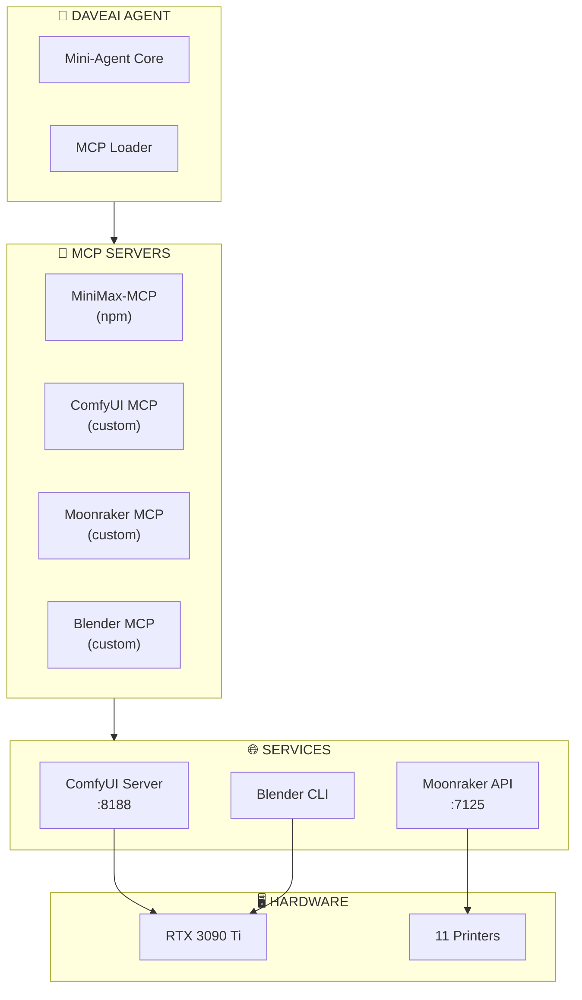

# 08 - MCP Servers

Custom MCP servers that connect DaveAI to ComfyUI, Klipper/Moonraker, and Blender.

---

## Overview



---

## MiniMax-MCP

**Source:** `npm install -g @minimax-ai/mcp-server`

### Tools

| Tool | Description | Example |
|------|-------------|---------|
| `images_understand` | Analyze images with AI vision | Analyze uploaded photo |
| `gen_images` | Generate images from prompts | Create reference images |
| `tts` | Text to speech | Voice notifications |
| `stt` | Speech to text | Voice commands |

### Configuration

```json
{
  "minimax": {
    "command": "npx",
    "args": ["-y", "@minimax-ai/mcp-server"],
    "env": {
      "MINIMAX_API_KEY": "${MINIMAX_API_KEY}"
    }
  }
}
```

### Usage Example

```
User: Print this toy figure
Agent: [uses images_understand]
→ Returns: "Toy figure, humanoid, 15cm tall"
```

---

## ComfyUI MCP

**Location:** `mcp/comfyui-mcp/__init__.py`

### Tools

| Tool | Description | Parameters |
|------|-------------|------------|
| `comfyui_queue_prompt` | Queue workflow for execution | `workflow: dict` |
| `comfyui_get_history` | Get execution history | `prompt_id: str` |
| `comfyui_get_queue` | Get current queue | - |
| `comfyui_get_system_stats` | VRAM/CPU usage | - |
| `comfyui_upload_image` | Upload image to ComfyUI | `image_path: str` |
| `comfyui_get_output` | Download output file | `filename: str`, `save_path: str` |
| `comfyui_interrupt` | Stop current execution | - |
| `comfyui_clear_queue` | Clear queue | - |

### Configuration

```json
{
  "comfyui": {
    "command": "python",
    "args": ["-m", "mcp.comfyui-mcp"],
    "env": {
      "COMFYUI_HOST": "localhost",
      "COMFYUI_PORT": "8188",
      "COMFYUI_OUTPUT_DIR": "./output/comfyui"
    },
    "execute_timeout": 300
  }
}
```

### Usage Example

```python
# Queue a 3D generation
comfyui_queue_prompt({
    "workflow": {
        "3": {"class_type": "LoadImage", "inputs": {"image": "toy.jpg"}},
        "4": {"class_type": "Hunyuan3D", "inputs": {"image": "3"}}
    }
})

# Check status
comfyui_get_history("prompt-123")

# Download output
comfyui_get_output("hunyuan3d_output.obj", "./output/model.obj")
```

---

## Moonraker MCP

**Location:** `mcp/moonraker-mcp/__init__.py`

### Fleet Management Tools

| Tool | Description | Parameters |
|------|-------------|------------|
| `moonraker_get_fleet_status` | All printer statuses | - |
| `moonraker_get_printer_status` | Single printer state | `printer: str` |
| `moonraker_get_print_stats` | Current job progress | `printer: str` |
| `moonraker_get_temps` | Temperature readings | `printer: str` |

### Print Job Tools

| Tool | Description | Parameters |
|------|-------------|------------|
| `moonraker_list_files` | Files on printer | `path: str`, `printer: str` |
| `moonraker_upload_file` | Upload STL/G-code | `file_path: str`, `printer: str` |
| `moonraker_delete_file` | Remove file | `filename: str`, `printer: str` |
| `moonraker_start_print` | Start print job | `filename: str`, `printer: str` |
| `moonraker_cancel_print` | Cancel active job | `printer: str` |
| `moonraker_pause_print` | Pause job | `printer: str` |
| `moonraker_resume_print` | Resume paused | `printer: str` |

### Control Tools

| Tool | Description | Parameters |
|------|-------------|------------|
| `moonraker_emergency_stop` | Immediate stop | `printer: str` |
| `moonraker_home` | Home axes | `axes: ["x","y","z"]`, `printer: str` |
| `moonraker_set_temp` | Set heater temp | `heater: str`, `temp: float` |

### Configuration

```json
{
  "moonraker": {
    "type": "streamable_http",
    "url": "http://mainsail.local:7125",
    "headers": {
      "X-Api-Key": "${MOONRAKER_API_KEY}"
    },
    "execute_timeout": 60
  }
}
```

### Moonraker API Endpoints

| Endpoint | Method | Description |
|----------|--------|-------------|
| `/api/server/info` | GET | Server info |
| `/api/printer/objects/query` | GET | Printer state |
| `/api/files/local` | POST | Upload file |
| `/api/job/print` | POST | Start print |
| `/api/job/cancel` | POST | Cancel print |
| `/api/job/pause` | POST | Pause print |
| `/websocket` | WS | Real-time updates |

### Usage Example

```python
# Get fleet status
moonraker_get_fleet_status()

# Upload and print
moonraker_upload_file("./output/model.stl", "flsun_v400")
moonraker_start_print("model.stl", "flsun_v400")

# Monitor
moonraker_get_print_stats("flsun_v400")
# Returns: {"progress": 67, "eta": "1h 23m", "current_layer": 156}
```

---

## Blender MCP

**Location:** `mcp/blender-mcp/__init__.py`

### Mesh Processing Tools

| Tool | Description | Parameters |
|------|-------------|------------|
| `blender_import_obj` | Load OBJ file | `input_path: str` |
| `blender_repair_mesh` | Fix mesh issues | `input_path: str` |
| `blender_solidify` | Add wall thickness | `input_path: str`, `thickness: float` |
| `blender_export_stl` | Save as STL | `input_path: str`, `output_path: str` |
| `blender_check_printable` | Validate mesh | `input_path: str` |
| `blender_analyze_mesh` | Get dimensions | `input_path: str` |
| `blender_full_pipeline` | Complete workflow | `input_path`, `output_path`, `thickness` |

### Configuration

```json
{
  "blender": {
    "command": "blender",
    "args": ["--background", "--python", "./mcp/blender-mcp/__init__.py"],
    "env": {
      "BLENDER_OUTPUT_DIR": "./output/blender"
    },
    "execute_timeout": 120
  }
}
```

### Pipeline


### Usage Example

```python
# Full pipeline
blender_full_pipeline(
    input_path="./output/comfyui/model.obj",
    output_path="./output/blender/model.stl",
    thickness=2.5
)

# Check printability
blender_check_printable("./output/blender/model.stl")
# Returns: {"is_printable": true, "dimensions": {...}, "warnings": []}
```

---

## Installation

### 1. MiniMax-MCP

```bash
# Install via npm
npm install -g @minimax-ai/mcp-server

# Or use npx directly (no install)
npx -y @minimax-ai/mcp-server
```

### 2. Custom MCPs

```bash
# Install dependencies
cd 3d-printer-daveai
uv sync

# Verify Blender CLI works
blender --version

# Test Moonraker connectivity
curl http://mainsail.local:7125/api/server/info
```

### 3. Configure mcp.json

```json
{
  "mcpServers": {
    "minimax": {
      "command": "npx",
      "args": ["-y", "@minimax-ai/mcp-server"],
      "env": {
        "MINIMAX_API_KEY": "${MINIMAX_API_KEY}"
      }
    },

    "comfyui": {
      "command": "python",
      "args": ["-m", "mcp.comfyui-mcp"],
      "env": {
        "COMFYUI_HOST": "localhost",
        "COMFYUI_PORT": "8188"
      }
    },

    "moonraker": {
      "type": "streamable_http",
      "url": "http://mainsail.local:7125"
    },

    "blender": {
      "command": "blender",
      "args": ["--background", "--python", "./mcp/blender-mcp/__init__.py"]
    }
  }
}
```

---

## Troubleshooting

### MCP Tools Not Loading

```bash
# Check mcp.json syntax
cat config/mcp.json | python -m json.tool

# Verify file paths exist
ls -la mcp/comfyui-mcp/
ls -la mcp/moonraker-mcp/
ls -la mcp/blender-mcp/
```

### ComfyUI Timeout

```json
{
  "comfyui": {
    "execute_timeout": 600  // Increase for large models
  }
}
```

### Moonraker Connection Failed

```bash
# Test connectivity
curl http://mainsail.local:7125/api/server/info

# Check API key if auth enabled
# In Moonraker config: enable_api_key: true
```

### Blender Not Found

```bash
# Find Blender installation
where blender
# or
which blender

# Update mcp.json with full path
{
  "blender": {
    "command": "C:\\Program Files\\Blender Foundation\\Blender 4.0\\blender.exe",
    ...
  }
}
```

---

## Development

### Creating New MCP Server

1. Create `mcp/{name}/__init__.py`
2. Implement `list_tools()` and `call_tool()`
3. Add to `mcp.json`
4. Test with Mini-Agent

```python
from mcp.server import Server
from mcp.server.stdio import stdio_server
from mcp.types import Tool, TextContent

server = Server("my-mcp")

@server.list_tools()
async def list_tools() -> list[Tool]:
    return [Tool(name="my_tool", description="...", inputSchema={...})]

@server.call_tool()
async def call_tool(name: str, arguments: dict) -> list[TextContent]:
    # Your implementation
    return [TextContent(type="text", text="result")]
```
