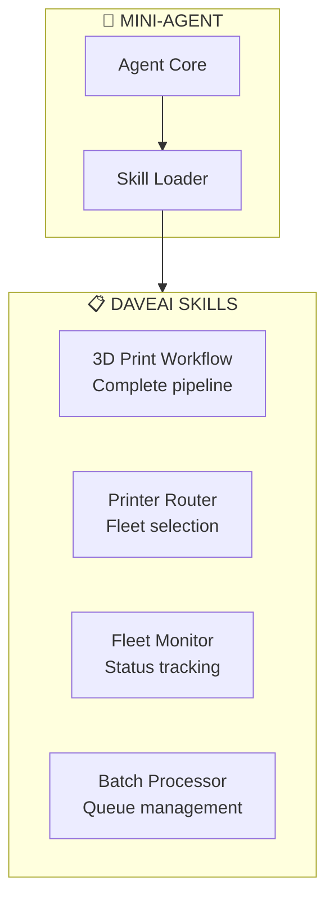
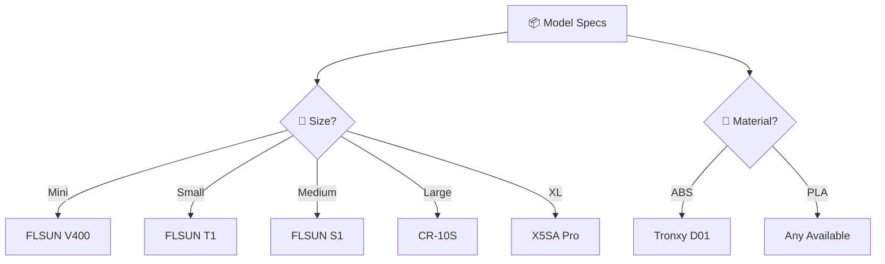
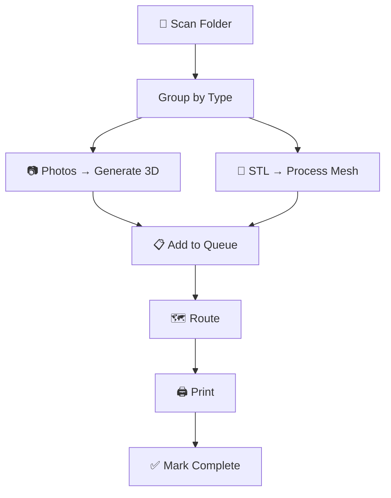

# 09 - Skills

Custom skills that define DaveAI's behavior for 3D printing workflows.

---

## Overview

Skills are instruction packs that enhance Mini-Agent's capabilities for specific tasks.



---

## Skill Structure

```
skills/
├── 3d-print-workflow/
│   └── SKILL.md          # Main workflow skill
├── printer-router/
│   └── SKILL.md          # Fleet routing
├── fleet-monitor/
│   └── SKILL.md          # Status monitoring
└── batch-processor/
    └── SKILL.md          # Queue handling
```

### SKILL.md Format

```markdown
---
name: skill-name
description: When to use this skill
---

# Skill Name

## Instructions
- Step 1
- Step 2
- Step 3

## Examples
[Example usage]
```

---

## 3D Print Workflow Skill

**Location:** `skills/3d-print-workflow/SKILL.md`

### Purpose
Execute the complete 3D print pipeline from photo to physical print.

### Workflow Steps


### Usage

```
User: Print this toy
Agent: [activates 3d-print-workflow skill]
→ Analyze photo
→ Generate via ComfyUI
→ Process via Blender
→ Route to optimal printer
→ Start print
→ Monitor progress
```

### Configuration

| Parameter | Default | Description |
|-----------|---------|-------------|
| `thickness` | 2.5mm | Wall thickness |
| `layer_height` | 0.2mm | Layer height |
| `quality` | standard | Generation quality |

---

## Printer Router Skill

**Location:** `skills/printer-router/SKILL.md`

### Purpose
Select the optimal printer from the fleet based on model specs.

### Decision Matrix



### Fleet Reference

| Printer | Build Volume | Best For |
|---------|-------------|----------|
| FLSUN V400 | 300x300mm | Miniatures, speed |
| FLSUN T1 x2 | 300x400mm | Balanced |
| FLSUN S1 | 300x400mm | General |
| FLSUN Super Racer | 300x400mm | Speed |
| CR-10S | 300x300x400mm | Large |
| CR-6 Max | 300x300x400mm | Large, stable |
| Tronxy D01 | Enclosed | ABS, ASA |
| X5SA Pro | 330x330x400mm | XL |
| Prusa MK3S | 250x210x210mm | Precision |
| Sovol SV-01 | 280x280x320mm | Testing |

### Routing Rules

```yaml
size_thresholds:
  miniature: 50mm
  small: 100mm
  medium: 200mm
  large: 300mm

material_requirements:
  abs:
    requires_enclosure: true
    preferred: [tronxy_d01]
  asa:
    requires_enclosure: true
    preferred: [tronxy_d01]
```

---

## Fleet Monitor Skill

**Location:** `skills/fleet-monitor/SKILL.md`

### Purpose
Track printer status and print progress.

### Status Types

| Status | Icon | Meaning |
|--------|------|---------|
| `idle` | 🟢 | Ready for print |
| `printing` | 🔵 | Active job |
| `paused` | 🟡 | Job paused |
| `error` | 🔴 | Problem detected |
| `offline` | ⚫ | Cannot connect |

### Fleet Overview Format

```
🖨️ FLEET STATUS

🟢 IDLE (7)
  • FLSUN V400
  • FLSUN T1 #1
  • ...

🔵 PRINTING (4)
  • FLSUN T1 #2: dragon.stl - 67% - ETA 1h 23m
  • FLSUN Super Racer: proto.stl - 23%
  • ...

⚠️ ERROR (0)
  None
```

### Print Progress Format

```
🖨️ FLSUN T1 #2

Status: 🔵 PRINTING
Job: dragon_v3.stl
Progress: 67%
Layer: 156 / 234
Elapsed: 1h 12m
ETA: 1h 23m

Temps:
  Bed: 60°C / 60°C ✓
  Nozzle: 210°C / 210°C ✓
```

---

## Batch Processor Skill

**Location:** `skills/batch-processor/SKILL.md`

### Purpose
Handle multiple print jobs from a queue.

### Queue Structure

```yaml
jobs:
  - id: "uuid-1"
    input_file: "dragon.jpg"
    status: "printing"
    priority: 1
  - id: "uuid-2"
    input_file: "gear.stl"
    status: "pending"
    priority: 2
```

### Batch Flow



### Limits

| Resource | Max Concurrent |
|----------|---------------|
| 3D Generation | 2 |
| Blender | 2 |
| Prints | 11 (full fleet) |

### Batch Status Format

```
📋 PRINT QUEUE - 8 jobs

Processing: 2
  [1] dragon.jpg → Generating (45%)
  [2] gear.stl → Processing (20%)

Printing: 3
  [3] FLSUN T1 #1: dragon_v2.stl - 67%
  [4] CR-6 Max: gear_set.stl - 23%
  [5] X5SA Pro: baseplate.stl - 8%

Pending: 3
  [6] mech_part.obj
  [7] figurine.stl
  [8] prototype.obj

Completed today: 12
```

---

## Adding Custom Skills

### 1. Create Skill Directory

```bash
mkdir skills/my-custom-skill
touch skills/my-custom-skill/SKILL.md
```

### 2. Write SKILL.md

```markdown
---
name: my-custom-skill
description: When to use this skill
---

# My Custom Skill

## When to Use
- User wants to do X
- Y scenario occurs

## Steps
1. First step
2. Second step
3. Third step

## Examples
User: "Do X"
Agent: [uses my-custom-skill]
→ Result
```

### 3. Load in Agent

Skills are auto-loaded from `skills/` directory if `enable_skills: true` in config.

---

## Skill Development Guidelines

### Good Skill Structure

1. **Clear trigger** - When should this skill activate?
2. **Step-by-step** - Numbered steps for agent
3. **Examples** - Concrete usage examples
4. **Error handling** - What to do when things fail

### Skill Best Practices

```markdown
---
name: skill-name
description: Use when user wants X
---

# Skill Name

## Purpose
Brief explanation of what this skill does.

## Prerequisites
- Thing 1 must be ready
- Thing 2 must be available

## Steps
1. Do this first
2. Then do this
3. Finally do this

## Error Recovery
- If step 1 fails: retry X
- If step 2 fails: skip to step 4
- If all fail: notify user

## Example
User: "Do X with Y"
Agent: [activates skill]
→ Step 1: ...
→ Step 2: ...
→ Complete!
```

---

## Skill Registry

| Skill | Purpose | Priority |
|-------|---------|----------|
| `3d-print-workflow` | Main print pipeline | 1 |
| `printer-router` | Printer selection | 2 |
| `fleet-monitor` | Status tracking | 3 |
| `batch-processor` | Queue management | 4 |

Priority determines skill activation order when multiple skills match.
