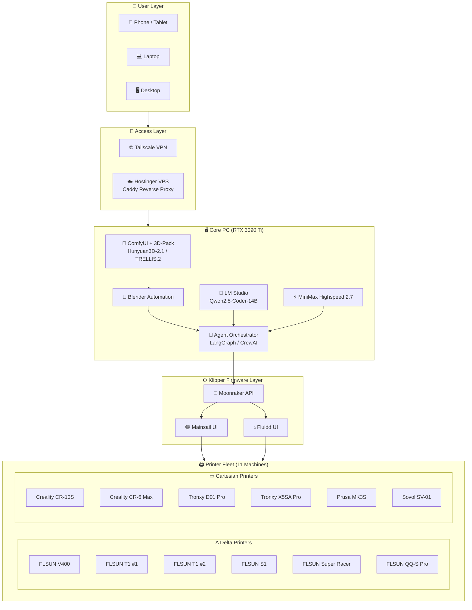

# DaveAI - Agentic 3D Print Factory v1.0

**Local • Private • Unlimited • Fleet-Optimized • Agentic**

*Owner: Matrix Agent | Date: April 26, 2026*

---

## Philosophy

```
┌─────────────────────────────────────────────────────────────────────────┐
│                    CORE PRINCIPLES                                      │
├─────────────────────────────────────────────────────────────────────────┤
│  ✓ 100% Local & Private  → Nothing leaves your network                 │
│  ✓ Unlimited Generations → No credits, no limits                       │
│  ✓ Intelligent Routing   → Smart fleet management                       │
│  ✓ Fully Agentic        → Mini-Agent powered automation                │
│  ✓ MiniMax Powered      → Vision, voice, media via MCP                 │
└─────────────────────────────────────────────────────────────────────────┘
```

---

## System Overview

This system transforms reference photos into **physical 3D prints** using an autonomous agent:

| Component | Technology | Purpose |
|-----------|------------|---------|
| **Agent Core** | Mini-Agent | Orchestration, memory, tool execution |
| **Media Tools** | MiniMax-MCP | Vision analysis, image generation |
| **3D Generation** | ComfyUI + Hunyuan3D-2.1 / TRELLIS.2 | Image → 3D mesh |
| **Post-Processing** | Blender + Python automation | Print-ready STL |
| **LLM Intelligence** | MiniMax 2.7 | Workflow decisions |
| **Fleet Control** | Klipper + Moonraker API | Multi-printer management |
| **Custom MCPs** | ComfyUI/Blender/Moonraker | Hardware integration |
| **Remote Access** | Tailscale + Hostinger VPS | Anywhere control |

---

## Architecture Diagram



---

## Quick Start

### 1. Generate a Model

```bash
# Drop photo in input folder
# Agent automatically:
#   1. Analyzes image
#   2. Generates 3D via ComfyUI
#   3. Processes in Blender
#   4. Routes to optimal printer
#   5. Queues print job
```

### 2. Access Your Fleet

```
🌐 Local:    http://mainsail.local  (or fluidd.local)
📱 Remote:   https://comfy.yourdomain.com (via Tailscale)
```

---

## Printer Fleet Summary

| Printer | Type | Interface | Best For |
|---------|------|-----------|----------|
| FLSUN V400 | Delta | Klipper/Mainsail | High-speed miniatures |
| FLSUN T1 x2 | Delta | Klipper/Mainsail | Fast prototypes |
| FLSUN S1 | Delta | Klipper/Mainsail | General purpose |
| FLSUN Super Racer | Delta | Klipper/Mainsail | Balanced speed + detail |
| FLSUN QQ-S Pro | Delta | Klipper/Mainsail | Large delta prints |
| Creality CR-10S | Cartesian | Klipper/Mainsail | Large format |
| Creality CR-6 Max | Cartesian | Klipper/Mainsail | Large detailed prints |
| Tronxy D01 Pro | Cartesian | Klipper/Mainsail | ABS/engineering |
| Tronxy X5SA Pro | Cartesian | Klipper/Mainsail | Large format |
| Prusa MK3S | Cartesian | Klipper/Mainsail | Highest detail |
| Sovol SV-01 | Cartesian | Klipper/Mainsail | General/testing |

---

## Key Technologies

- **ComfyUI**: Node-based AI image/video generation interface
- **Hunyuan3D-2.1**: Tencent's open-source 3D generation (best fidelity)
- **TRELLIS.2**: Microsoft's fast alternative (Microsoft TRELLIS)
- **Blender**: 3D modeling with Python automation
- **Klipper**: High-performance 3D printer firmware
- **Mainsail/Fluidd**: Web interfaces for Klipper
- **Moonraker**: Klipper REST API for automation
- **Tailscale**: Zero-config VPN for remote access
- **LangGraph**: Agent orchestration framework

---

## Documentation Index

| File | Description |
|------|-------------|
| `01-system-architecture.md` | Complete system architecture |
| `02-hardware-inventory.md` | All hardware specifications |
| `03-end-to-end-workflow.md` | Full workflow documentation |
| `04-fleet-routing.md` | Intelligent printer routing |
| `05-agentic-system.md` | Agent orchestration design |
| `06-blender-automation.md` | Blender Python scripts |
| `07-firmware-setup.md` | Klipper/Mainsail/Fluidd setup |

---

## License

Private use only. Built for maximum productivity.
